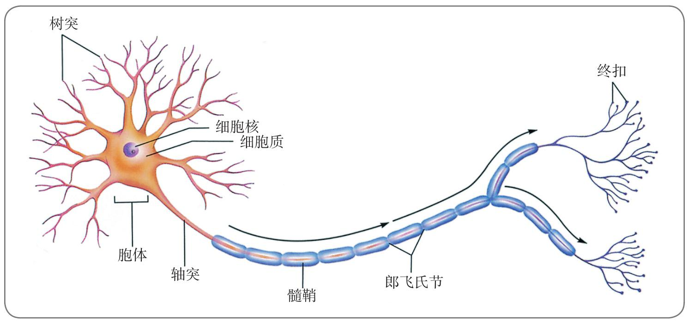
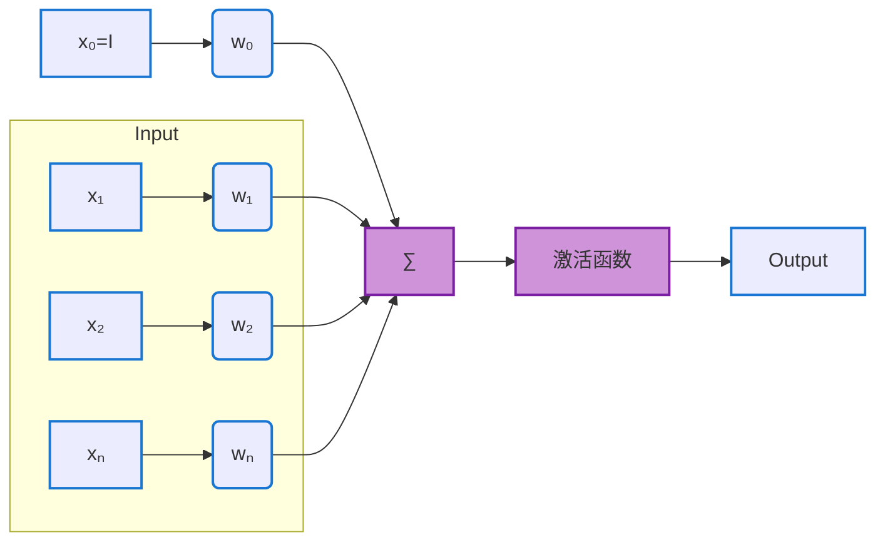
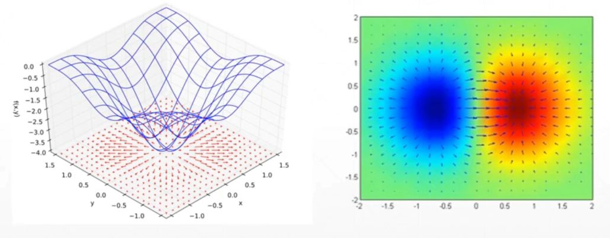
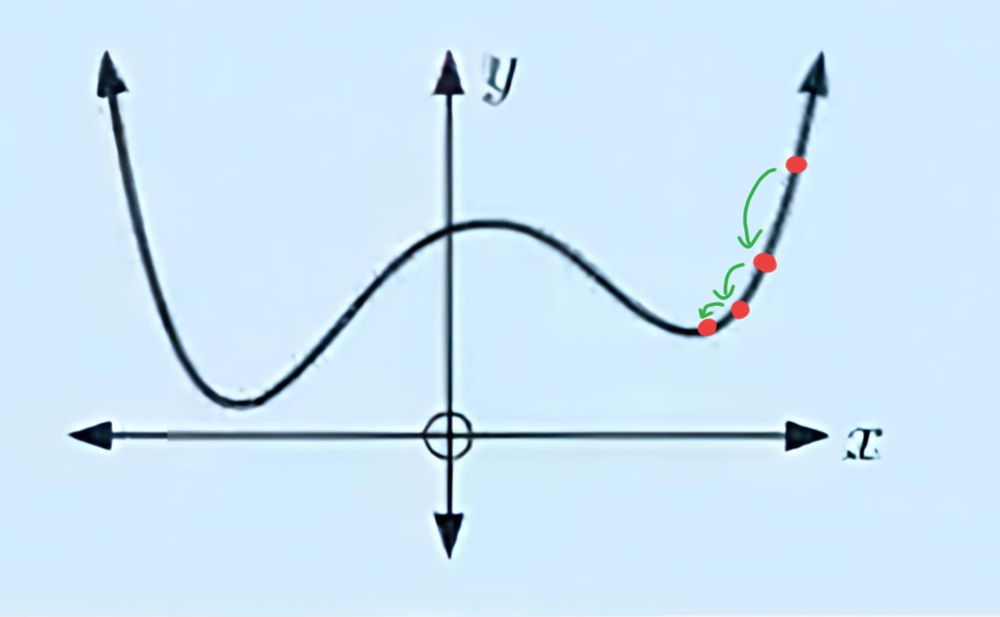
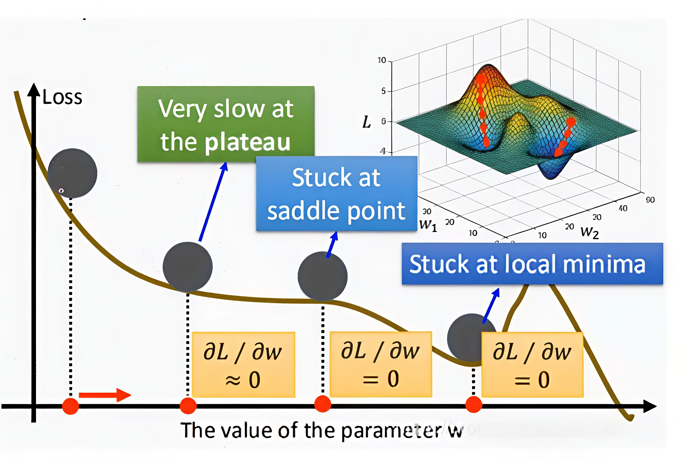

# 
感知机

###### 
YinKang'an

### 背景介绍
    
- 感知机是`支持向量机`和`神经网络`的基础.
- 感知机(Perceptron)是 **二分法** 的 **线性** 分类模型,其输入为实例的特征向量,输出为实例的类别,取 $+1$ 和 $-1$.感知机对输入空间(特征空间)中将实例划分成正负两类的分类超平面,属于 **分类模型**
 
- 感知机模型(生物机制)

- `Input`:实例的向量，每一列一个特征.
- `Weight`: 权重，设置初始值，并使用梯度下降法进行更新.
- `Bias`: 偏置，允许分类器左右移动决策边界，有助于更好.更快的训练模型.
- `Weighted sum`: 加权求和是Input向量和weight的乘积和.
- `Output`: 输出为类别，取+1，-1.
### 感知机的定义
给定训练数据集:
$$T=\{(x_1,y_1),(x_2,y_2),\cdots,(x_n,y_n)\}$$
其中:
$$x_i \in R_n , y_i \in \{+1,-1\} , i = 1,2,3,\cdots,n$$
输入 $x$ 表示实例的特征向量(有特征的向量,非线性代数的"特征向量"),对应输入空间的点,输出的 $y$ 代表样本的类别.
则感知机模型为:
$$f(x) = sign(\omega \cdot x + b)$$
符号函数:
$$sign(x) = \begin{cases}
+1, & x \geq 0 \\
-1, & x < 0
\end{cases}$$
### 感知机模型几何解释

$$T=\{(x_1,y_1),(x_2,y_2),...,(x_n,y_n)\}$$
线性方程:
$$\omega \cdot x + b = 0$$
对应超平面 $S$ , $\omega$ 为法向量, $b$ 为截距,分离正负类
### 感知机学习策略
如何定义损失函数
自然选择:误分类点的数目?但是损失函数不是 $w$ , $b$ 的函数(它不会随着 $w$ , $b$ 的变化而变化,会突变),不连续,不可导,不宜优化.不行.
定量描述**误分类点**到超平面的总距离:
$$\frac{1}{\|\omega\|}|\omega \cdot x_0 + b|$$
**误分类**的点:
$$-y_i (w \cdot x_i + b) > 0$$
误分类的点的总距离:
$$- \frac{1}{\| w \|} \sum_{x_i \in M} y_i (\omega \cdot x_i + b)$$

$\therefore$   感知机的损失函数:
$$L(w, b) = - \sum_{x_i \in M} y_i (w \cdot x_i + b)$$
为什么不考虑 $\frac{1}{\|\omega\|}$ 呢?
- [x] 分类的时候只需要考虑分类是否正确,而不在乎离超平面的距离
### 感知机的求解
- 补充:梯度
    1. 导数 derivate
    - 一维函数的导数
        $f'(x)$ 代表在 $x$ 处的**变化率**,也就是**斜率**
        但它只是在平面的表示, $x$ 向左向右的表示 
        而导数是一个非常宽泛的概念,它是一个标量,反映一个变化的程度
    - 二维函数的导数
        以 $ Z = y^2 - x^2$ 为例,它有朝不同方向(朝 $x$ , $y$ 或 $x.y$ 之间)的变化率

        

        还有更高纬度的函数,因此产生了`偏微分`的概念
    2. **偏微分 partial derivate**
        偏微分的方向是给定的自变量的方向,比如 $x$,$y$ 的方向
        $\frac{\partial z}{\partial x} = -2x$
        $\frac{\partial z}{\partial y} = +2y$
        这个函数有多少个自变量,他就有多少个偏微分
    3. <u>**梯度 gradient**</u>
        - 简介
        梯度是一个向量,它不是标量,它是一个特殊的导数,方向沿偏微分合成的方向
        $\nabla f = (\frac{\partial z}{\partial x_1};\frac{\partial z}{\partial x_2};...;\frac{\partial z}{\partial x_n})$ 
        以 $ Z = y^2 - x^2$ 为例,它的梯度是 $\nabla f(x,y)= (-2x,2y)$ 这样的向量
        - 梯度的意义
            

            - 长度代表变化速率
            - 方向代表增长方向
- 随机梯度下降法 求解感知机:

首先选择任意一个超平面, $\omega$ , $b$ ,然后不断极小化目标函数,损失函数 $L$ 的梯度:
$$\nabla_w L(w, b) = \frac{\partial}{\partial w} L(w, b) = - \sum_{x_i \in M} y_i x_i$$
$$\nabla_b L(w, b) = \frac{\partial}{\partial b} L(w, b) = - \sum_{x_i \in M} y_i$$
更新 $w$ , $ b $ :
$$w \leftarrow w + \eta y_i x_i \qquad \qquad b \leftarrow b + \eta y_i$$
- 但是随机梯度下降法可能会陷入到 **局部最优**

所以还有其他的梯度下降法

### 随机梯度下降法示意图

### 感知机算法的总结
 
- 输入
训练数据集:
$$T = \{ (x_1, y_1), (x_2, y_2), ..., (x_N, y_N) \}$$
其中：
$$x_i \in \mathbb{R}^n,\ y_i \in \{-1, +1\},\ i=1,2,...,N$$
学习率：
$$\eta \ (0 < \eta \leq 1)$$
 
- 输出
权重 $w$ ，偏置 $b$
---
感知机模型:
$$f(x) = sign(w \cdot x + b)$$ 
算法步骤:
1. 选择初始值 $w_0, b_0$

2. 在训练集中选取数据 $(x_i, y_i)$

3. 如果 $ y_i(w \cdot x_i + b) \leq 0 $

4. 求偏导并更新参数：

$ w \leftarrow w + \eta y_i x_i $
$ b \leftarrow b + \eta y_i $

5. 重复步骤(2)，直到训练集中没有误分类点