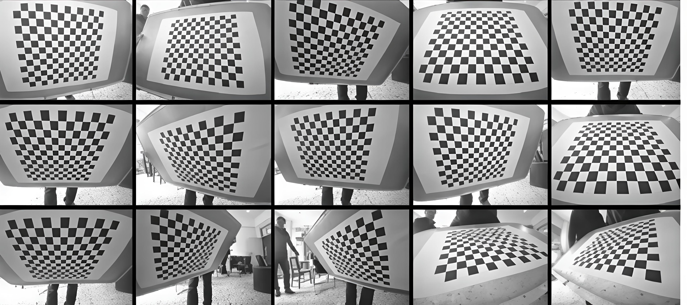
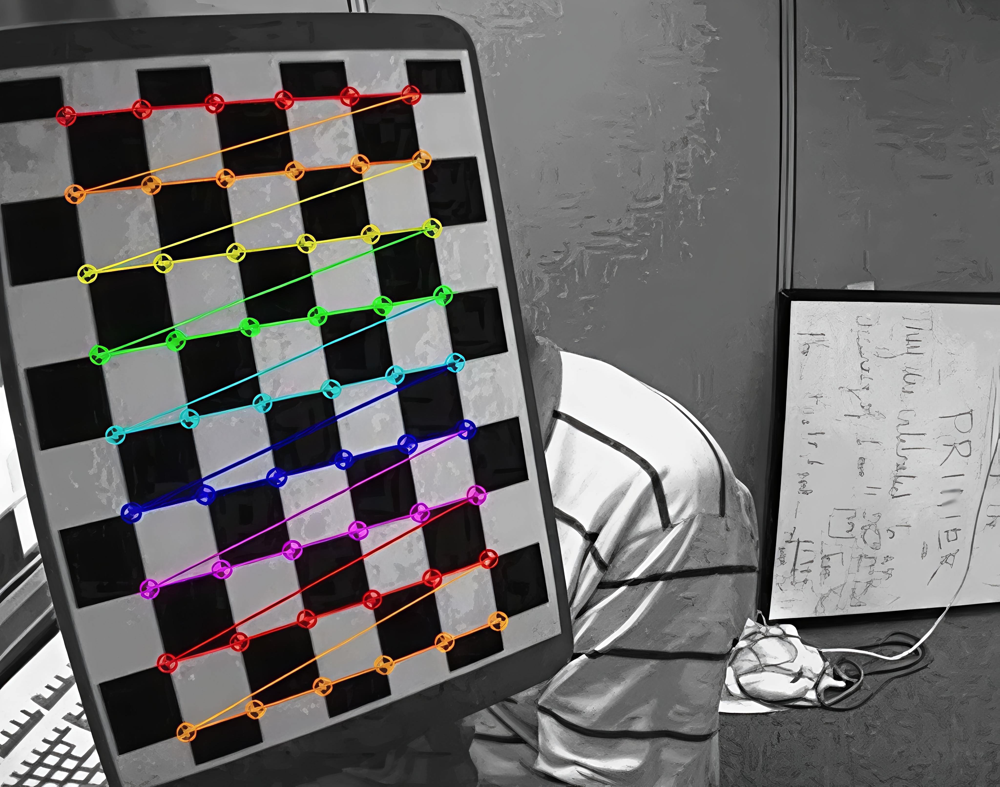
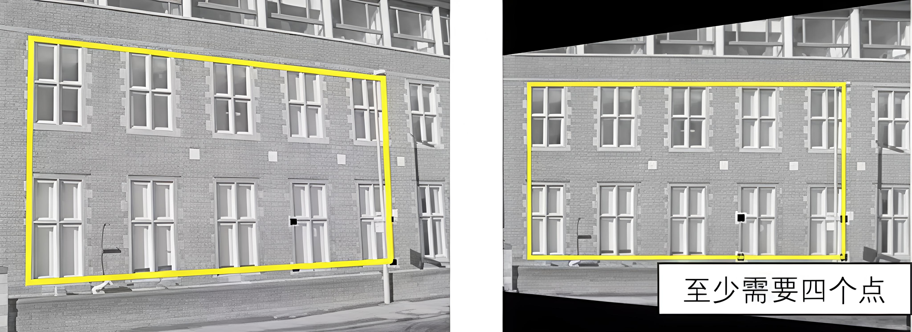
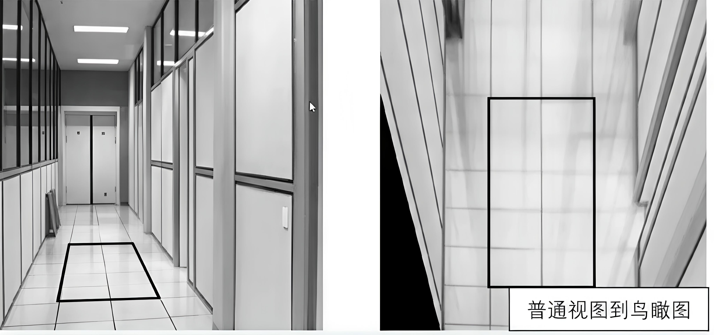
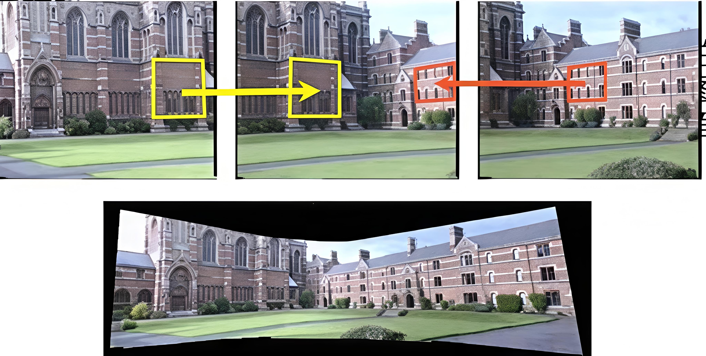
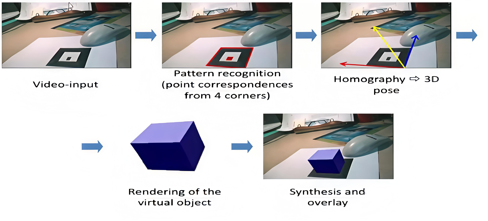

# <center><font face="黑体" font color=orange size=10>张正友相机标定法</font></center>
## <center><font face="黑体" size=5 font color=cyan>YinKang'an</font></center>

# 1. 坐标系转换基础 (从零开始理解相机标定)

## 1.1 相机标定是什么? (用大白话解释)

想象一下,你有一台相机,想要用它来测量物体的真实大小和距离.但是相机拍出来的照片是二维的,而真实世界是三维的.相机标定就是找到一种方法,让计算机能够知道:

- 照片上的一个像素点对应真实世界中的哪个位置
- 真实世界中的一个物体在照片上会出现在哪里

**简单来说,相机标定就是建立真实世界和照片之间的"翻译规则"!**

**为什么需要相机标定?**
- 机器人导航:让机器人知道障碍物离自己有多远
- 三维重建:从多张照片重建出物体的三维模型
- 增强现实:把虚拟物体准确地放在真实场景中
- 自动驾驶:判断前方车辆的距离和速度

## 1.2 世界坐标系与相机坐标系 (理解不同的"视角")

### 世界坐标系 (全局视角)
想象你站在一个房间里,房间的角落就是世界坐标系的原点.这个坐标系是固定的,不会因为你的移动而改变.

**特点:**
- 原点可以放在房间的任何位置
- 坐标轴方向固定不变
- 用来描述整个场景中所有物体的位置

### 相机坐标系 (相机视角)
现在想象你手里拿着相机,相机就是你的"眼睛".相机坐标系就是以相机为中心建立的坐标系.

**特点:**
- 原点在相机的镜头中心
- x轴指向相机右侧,y轴指向上方,z轴指向相机前方
- 这个坐标系会随着相机的移动而移动

**为什么需要两个坐标系?**
因为相机可以移动!同一个物体在世界坐标系中的位置是固定的,但在相机坐标系中的位置会随着相机的移动而改变.

## 1.3 世界坐标系到相机坐标系的转换 (坐标系之间的"搬家")

### 1.3.1 旋转操作 (调整方向)

想象你要把一本书从桌子上拿起来,需要先旋转书本使其与你的视线对齐.

**旋转的数学表示方法有很多种:**

1. **旋转矩阵** (最常用,最直观)
2. **欧拉角** (用三个角度表示旋转)
3. **四元数** (数学上更优雅,但理解起来较难)
4. **轴角** (绕某个轴旋转一定角度)

<center></center>

**绕X轴旋转的矩阵:**
```math
R(X, \theta) = \begin{bmatrix}
1 & 0 & 0 \\
0 & \cos\theta & -\sin\theta \\
0 & \sin\theta & \cos\theta
\end{bmatrix}
```

**这是什么意思呢?**
- 第一行 [1, 0, 0] 表示x轴保持不变
- 第二行 [0, cosθ, -sinθ] 表示y轴和z轴在y-z平面内旋转
- 第三行 [0, sinθ, cosθ] 也是y轴和z轴的旋转分量

**绕Y轴旋转的矩阵:**
```math
R(Y, \theta) = \begin{bmatrix}
\cos\theta & 0 & -\sin\theta \\
0 & 1 & 0 \\
\sin\theta & 0 & \cos\theta
\end{bmatrix}
```

**绕Z轴旋转的矩阵:**
```math
R(Z, \theta) = \begin{bmatrix}
\cos\theta & -\sin\theta & 0 \\
\sin\theta & \cos\theta & 0 \\
0 & 0 & 1
\end{bmatrix}
```

### 1.3.2 组合旋转 (连续旋转)

在实际应用中,我们通常需要绕多个轴旋转.这时候就需要把多个旋转矩阵组合起来.

**组合旋转矩阵的方法:**
```math
R_{total} = R(Z, \varphi) \times R(Y, \theta) \times R(X, \psi)
```

**注意:** 矩阵乘法的顺序很重要!不同的顺序会产生不同的结果.

### 1.3.3 平移操作 (移动位置)

旋转完成后,还需要把物体平移到相机坐标系的原点.

**平移的数学表示:**
```math
\begin{bmatrix} X_c \\ Y_c \\ Z_c \end{bmatrix} = R \begin{bmatrix} X_w \\ Y_w \\ Z_w \end{bmatrix} + T
```

其中:
- R是旋转矩阵
- T是平移向量 [tx, ty, tz]^T

### 1.3.4 齐次坐标 (更优雅的表示方法)

为了简化计算,数学家发明了齐次坐标.这种方法把旋转和平移合并到一个矩阵中.

**齐次坐标形式:**
```math
\begin{bmatrix} x_c \\ y_c \\ z_c \\ 1 \end{bmatrix} = \begin{bmatrix} R & t \\ 0 & 1 \end{bmatrix} \begin{bmatrix} x_w \\ y_w \\ z_w \\ 1 \end{bmatrix}
```

**齐次坐标的好处:**
- 把复杂的变换变成简单的矩阵乘法
- 方便计算机处理
- 可以表示无穷远点

### 1.3.5 相机外参 (Camera Extrinsics)

旋转矩阵R和平移向量t合称为**相机外参**.这些参数描述了相机在世界坐标系中的位置和朝向.

**外参的作用:**
- 确定相机的位置和方向
- 建立世界坐标系和相机坐标系的联系
- 是相机标定需要求解的重要参数

## 1.4 像素坐标系与图像坐标系 (理解照片的"内部结构")

### 像素坐标系 (数字照片的"网格")

当你用手机拍照时,照片是由成千上万个彩色小点组成的,这些小点就是像素.

**像素坐标系的特点:**
- 原点在照片的左上角
- u轴水平向右,v轴垂直向下
- 坐标单位是"像素个数"
- 比如一张1920x1080的照片,宽度有1920个像素,高度有1080个像素

### 图像坐标系 (物理尺寸的坐标系)

像素坐标系虽然直观,但不适合进行精确的几何计算.因此我们需要图像坐标系.

**图像坐标系的特点:**
- 原点在照片的中心(光轴与成像平面的交点)
- 坐标单位是物理尺寸(如毫米)
- X轴和Y轴分别与u轴和v轴平行

### 1.4.1 两个坐标系的关系

像素坐标系和图像坐标系之间是简单的平移关系.

**转换公式:**
```math
\begin{bmatrix} u \\ v \\ 1 \end{bmatrix} = \begin{bmatrix} 1/dX & 0 & u_0 \\ 0 & 1/dY & v_0 \\ 0 & 0 & 1 \end{bmatrix} \begin{bmatrix} X \\ Y \\ 1 \end{bmatrix}
```

**公式解释:**
- dX, dY: 每个像素的物理尺寸(毫米/像素)
- u0, v0: 主点坐标(图像中心在像素坐标系中的位置)
- 公式含义: 物理坐标除以像素尺寸得到像素数,再加上主点偏移

## 1.5 针孔成像原理 (相机如何"看"世界)

### 1.5.1 基本原理

相机的工作原理类似于针孔相机.光线通过一个小孔(镜头)在感光元件上形成倒立的像.

<center></center>

**关键发现:** 相似三角形原理
```math
\frac{X}{f} = \frac{x_c}{z_c}
```

其中:
- X: 图像坐标系中的坐标
- f: 焦距(镜头到感光元件的距离)
- xc: 相机坐标系中的x坐标
- zc: 相机坐标系中的z坐标(深度)

### 1.5.2 透视投影矩阵

用矩阵形式表示针孔成像原理:
```math
s \begin{bmatrix} X \\ Y \\ 1 \end{bmatrix} = \begin{bmatrix} f & 0 & 0 & 0 \\ 0 & f & 0 & 0 \\ 0 & 0 & 1 & 0 \end{bmatrix} \begin{bmatrix} x_c \\ y_c \\ z_c \\ 1 \end{bmatrix}
```

**重要发现:** 比例因子s实际上就是深度值zc!
```math
s = z_c
```

**这意味着什么?**
深度信息并没有丢失,而是被编码在透视投影的过程中!

## 1.6 完整的坐标系转换流程

现在让我们把所有的转换步骤串联起来:

### 步骤1: 世界坐标系 → 相机坐标系
```math
\begin{bmatrix} x_c \\ y_c \\ z_c \\ 1 \end{bmatrix} = \begin{bmatrix} R & t \\ 0 & 1 \end{bmatrix} \begin{bmatrix} x_w \\ y_w \\ z_w \\ 1 \end{bmatrix}
```

### 步骤2: 相机坐标系 → 图像坐标系
```math
s \begin{bmatrix} X \\ Y \\ 1 \end{bmatrix} = \begin{bmatrix} f & 0 & 0 & 0 \\ 0 & f & 0 & 0 \\ 0 & 0 & 1 & 0 \end{bmatrix} \begin{bmatrix} x_c \\ y_c \\ z_c \\ 1 \end{bmatrix}
```

### 步骤3: 图像坐标系 → 像素坐标系
```math
\begin{bmatrix} u \\ v \\ 1 \end{bmatrix} = \begin{bmatrix} 1/dX & 0 & u_0 \\ 0 & 1/dY & v_0 \\ 0 & 0 & 1 \end{bmatrix} \begin{bmatrix} X \\ Y \\ 1 \end{bmatrix}
```

### 完整的转换公式
```math
s \begin{bmatrix} u \\ v \\ 1 \end{bmatrix} = \begin{bmatrix} 1/dX & 0 & u_0 \\ 0 & 1/dY & v_0 \\ 0 & 0 & 1 \end{bmatrix} \begin{bmatrix} f & 0 & 0 & 0 \\ 0 & f & 0 & 0 \\ 0 & 0 & 1 & 0 \end{bmatrix} \begin{bmatrix} R & t \\ 0 & 1 \end{bmatrix} \begin{bmatrix} x_w \\ y_w \\ z_w \\ 1 \end{bmatrix}
```

### 简化形式
```math
= \begin{bmatrix} \alpha_x & 0 & u_0 & 0 \\ 0 & \alpha_y & v_0 & 0 \\ 0 & 0 & 1 & 0 \end{bmatrix} \begin{bmatrix} R & t \\ 0 & 1 \end{bmatrix} \begin{bmatrix} x_w \\ y_w \\ z_w \\ 1 \end{bmatrix} = M_1 M_2 X_w = M X_w
```

其中:
- αx = f/dX, αy = f/dY (尺度因子)
- M1: 相机内参矩阵
- M2: 相机外参矩阵
- M: 投影矩阵

## 1.7 深度信息去哪了? (三维到二维的奥秘)

这是一个非常重要的问题!很多人会问:"三维世界有深度信息,为什么二维照片看起来是平的?深度信息去哪了?"

### 1.7.1 深度信息并没有丢失!

让我们仔细分析转换过程:

**在相机坐标系中,深度信息(zc)仍然存在:**
```math
\begin{bmatrix} x_c \\ y_c \\ z_c \\ 1 \end{bmatrix}
```

**在透视投影中,深度信息被"用"掉了:**
```math
X = \frac{f \cdot x_c}{z_c}, \quad Y = \frac{f \cdot y_c}{z_c}
```

**关键发现:** 深度信息zc变成了比例因子,用来控制透视效果!

### 1.7.2 深度信息的三个重要作用

1. **控制透视效果** (近大远小)
   - 物体离相机越远(zc越大),在照片上显得越小
   - 物体离相机越近(zc越小),在照片上显得越大

2. **作为比例因子**
   - 把三维坐标按距离比例缩放到二维平面
   - 确保几何关系的正确性

3. **编码相对深度**
   - 虽然丢失了绝对深度,但保留了物体之间的相对深度关系
   - 这就是为什么我们能在照片中判断哪个物体在前,哪个在后

### 1.7.3 齐次坐标的巧妙设计

齐次坐标的引入正是为了处理深度信息:
```math
\begin{bmatrix} X \\ Y \\ 1 \end{bmatrix} \sim \begin{bmatrix} f \cdot x_c / z_c \\ f \cdot y_c / z_c \\ 1 \end{bmatrix}
```

**等号右边的向量实际上就是:**
```math
\frac{1}{z_c} \begin{bmatrix} f \cdot x_c \\ f \cdot y_c \\ z_c \end{bmatrix}
```

深度信息zc既作为分母完成缩放,又作为分子的一部分保留了下来!

### 1.7.4 实际应用意义

这种巧妙的转换方式正是透视投影的精髓:

- **近大远小效应**: 让照片看起来更真实
- **深度感知**: 虽然无法直接测量绝对距离,但能判断相对位置
- **计算机视觉基础**: 为立体视觉、三维重建等技术奠定基础

**总结:** 深度信息并没有真正"丢失",而是完成了它作为"透视编码器"的使命,将三维世界的信息巧妙地映射到了二维图像上!

# 2. 相机畸变与矫正 (为什么照片会变形?)

## 2.1 什么是相机畸变? (理解照片变形的原因)

当你用广角镜头拍照时,可能会发现照片边缘的直线变成了曲线.这种现象就是相机畸变.

### 2.1.1 畸变的定义

**畸变**是指实际成像与理想直线投影之间的偏差.

**简单理解:**
- 理想情况: 场景中的直线在照片上也应该是直线
- 实际情况: 由于镜头不完美,直线可能会变成曲线

### 2.1.2 为什么会产生畸变?

1. **镜头形状不完美**: 镜片不是理想的球面
2. **组装误差**: 镜头和传感器没有完全对齐
3. **材料特性**: 光学材料的折射率不均匀

## 2.2 畸变的分类 (两种主要类型)

### 2.2.1 径向畸变 (Radial Distortion)

<center></center>

**产生原因:** 镜头形状导致的成像偏差
- 光线在远离镜头中心的地方弯曲更严重
- 类似于"鱼眼"或"筒形"效果

**三种典型的径向畸变:**

1. **桶形畸变** (Barrel Distortion)
   - 图像中心向外凸出,边缘向内收缩
   - 常见于广角镜头

2. **枕形畸变** (Pincushion Distortion)
   - 图像中心向内凹陷,边缘向外凸出
   - 常见于长焦镜头

3. **胡子畸变** (Mustache Distortion)
   - 混合了桶形和枕形畸变
   - 图像中心区域和边缘区域的畸变方向不同

<center></center>

### 2.2.2 切向畸变 (Tangential Distortion)

<center></center>

**产生原因:** 镜头与传感器不平行
- 镜头制造或组装过程中的误差
- 导致图像在切向方向发生偏移

<center></center>

## 2.3 畸变矫正公式 (如何修复变形的照片)

### 2.3.1 径向畸变矫正

**矫正公式:**
```math
x_{corr} = x_{dis}(1 + k_1 r^2 + k_2 r^4 + k_3 r^6)
```
```math
y_{corr} = y_{dis}(1 + k_1 r^2 + k_2 r^4 + k_3 r^6)
```

**公式解释:**
- x_dis, y_dis: 畸变点的坐标
- x_corr, y_corr: 矫正后的坐标
- r: 点到图像中心的距离 (r² = x_dis² + y_dis²)
- k1, k2, k3: 径向畸变系数

**工作原理:**
根据点到图像中心的距离,给坐标乘以一个修正因子,把变形的点"拉回"正确位置.

### 2.3.2 切向畸变矫正

**矫正公式:**
```math
x_{corr} = x_{dis} + [2p_1 xy + p_2(r^2 + 2x^2)]
```
```math
y_{corr} = y_{dis} + [p_1(r^2 + 2y^2) + 2p_2 xy]
```

**公式解释:**
- p1, p2: 切向畸变系数
- 在原始坐标上叠加一个切向偏移量

### 2.3.3 完整的畸变参数

**5个畸变参数:**
```math
D = (k_1, k_2, p_1, p_2, k_3)
```

这些参数需要通过相机标定来确定.

## 2.4 畸变矫正的实际应用

### 2.4.1 为什么需要矫正畸变?

1. **提高测量精度**: 消除镜头变形带来的误差
2. **图像拼接**: 确保多张照片能够准确对齐
3. **三维重建**: 保证几何关系的准确性
4. **机器视觉**: 提高目标检测和识别的准确性

### 2.4.2 矫正效果示例

未经矫正的照片:
- 直线变成曲线
- 几何形状失真
- 距离测量不准确

经过矫正的照片:
- 直线保持笔直
- 几何形状正确
- 测量结果准确

# 3. 张正友相机标定法 (革命性的标定方法)

## 3.1 相机标定方法的发展历程

### 3.1.1 传统标定方法

**特点:**
- 使用高精度的三维标定物
- 精度很高,但成本昂贵
- 操作复杂,不够灵活

**局限性:**
- 需要专门的标定设备
- 不适合普通用户使用
- 应用场景有限

### 3.1.2 自标定方法

**特点:**
- 不需要专门的标定物
- 利用场景中的自然特征
- 灵活性高

**局限性:**
- 精度较低
- 稳定性差
- 计算复杂

### 3.1.3 张正友标定法的突破

张正友博士在1999年提出的方法完美地结合了传统方法和自标定方法的优点!

## 3.2 张正友博士简介

**张正友博士**是世界著名的计算机视觉专家,现任微软研究院视觉技术组高级研究员.

**主要贡献:**
- 立体视觉
- 三维重建
- 运动分析
- 图像配准
- 相机标定

**张氏标定法的意义:**
极大地促进了三维计算机视觉从实验室走向实际应用!

## 3.3 张氏标定法的核心思想

### 3.3.1 使用平面棋盘格

<center></center>

**为什么选择棋盘格?**
1. **容易制作**: 任何人都可以打印
2. **特征明显**: 角点容易检测
3. **几何规则**: 方格大小已知
4. **成本低廉**: 不需要昂贵设备

### 3.3.2 巧妙的数学简化

**关键技巧:** 将棋盘放在世界坐标系的XY平面上,使得 zw = 0

<center></center>

**这个设定的好处:**
- 把复杂的三维问题简化为二维问题
- 大大降低了计算复杂度
- 提高了标定的稳定性和精度

### 3.3.3 简化后的转换公式

```math
\begin{bmatrix} u \\ v \\ 1 \end{bmatrix} = s \begin{bmatrix} f_x & \gamma & u_0 \\ 0 & f_y & v_0 \\ 0 & 0 & 1 \end{bmatrix} \begin{bmatrix} r_1 & r_2 & t \end{bmatrix} \begin{bmatrix} x_w \\ y_w \\ 1 \end{bmatrix}
```

**公式说明:**
- 由于zw=0,旋转矩阵的第三列r3不再需要
- 问题从6自由度降低到8自由度
- 计算变得更加简单和稳定

## 3.4 张氏标定法的操作步骤

### 步骤1: 准备标定板
- 打印棋盘格图案
- 确保图案平整
- 方格大小已知

### 步骤2: 拍摄多张照片
- 从不同角度拍摄棋盘格
- 确保棋盘格在照片中清晰可见
- 建议拍摄15-20张不同角度的照片

### 步骤3: 检测角点
- 自动检测棋盘格的角点位置
- 记录每个角点的图像坐标
- 建立角点的世界坐标和图像坐标对应关系

### 步骤4: 计算单应性矩阵
- 为每张照片计算单应性矩阵H
- H建立了世界平面和图像平面之间的映射关系

### 步骤5: 求解相机参数
- 利用单应性矩阵求解相机内参
- 计算相机外参(每张照片的位置和朝向)
- 估计畸变参数

### 步骤6: 优化参数
- 使用非线性优化方法 refine 所有参数
- 提高标定精度
- 消除噪声影响

## 3.5 张氏标定法的优势

### 3.5.1 实用性
- **设备简单**: 只需要打印的棋盘格
- **操作方便**: 任何人都可以完成
- **成本低廉**: 不需要昂贵设备

### 3.5.2 精度高
- **理论严谨**: 基于严格的数学推导
- **稳定性好**: 对噪声和误差有较强的鲁棒性
- **精度可控**: 可以通过增加照片数量提高精度

### 3.5.3 灵活性
- **场景适应性强**: 可以在各种环境下使用
- **相机类型不限**: 适用于各种类型的相机
- **扩展性好**: 可以很容易地扩展到其他应用

## 3.6 实际应用案例

### 3.6.1 机器人导航
- 让机器人准确感知环境
- 实现精确的路径规划
- 提高避障能力

### 3.6.2 三维重建
- 从多张照片重建三维模型
- 用于文物数字化保护
- 建筑测量和监控

### 3.6.3 增强现实
- 将虚拟物体准确地叠加到真实场景
- 用于游戏、教育、医疗等领域
- 提高用户体验的真实感

### 3.6.4 工业检测
- 精确测量产品尺寸
- 检测产品缺陷
- 提高生产质量

# 4. 单应性变换 (Homography) - 平面到平面的神奇映射

## 4.1 什么是单应性变换?

### 4.1.1 基本概念

单应性变换描述了两个平面之间的投影映射关系.在相机标定中,它建立了世界平面(棋盘格)和图像平面(照片)之间的对应关系.

**简单理解:** 单应性就像是给平面贴上了一张"透视贴纸",让平面在不同的视角下呈现出不同的形状.

### 4.1.2 单应性矩阵的定义

在张氏标定法中,单应性矩阵H定义为:

```math
H = s \begin{bmatrix} f_x & \gamma & u_0 \\ 0 & f_y & v_0 \\ 0 & 0 & 1 \end{bmatrix} \begin{bmatrix} r_1 & r_2 & t \end{bmatrix} = s M_1 \begin{bmatrix} r_1 & r_2 & t \end{bmatrix}
```

### 4.1.3 单应性矩阵的参数含义

1. **s (尺度因子)**
   - 本质是深度值zc的倒数
   - 用于齐次坐标的比例归一化
   - 确保变换的一致性

2. **γ (像素倾斜系数)**
   - 常规相机通常为0
   - 只有当像素不是严格正交排列时才需要
   - 现代相机一般不需要考虑这个参数

3. **u0, v0 (主点坐标)**
   - 图像中心在像素坐标系中的位置
   - 理论上应该是传感器的几何中心
   - 实际中由于安装误差需要标定

4. **r1, r2, t (外参简化)**
   - 由于zw=0,旋转矩阵的第三列r3不再需要
   - 大大简化了计算复杂度

## 4.2 单应性在计算机视觉中的应用

单应性变换在计算机视觉中有广泛的应用,下面介绍几个典型的应用场景.

### 4.2.1 图像矫正 (Image Rectification)

<center></center>

**应用场景:**
- 矫正倾斜拍摄的文档
- 纠正透视变形
- 生成正面视图

**工作原理:**
通过单应性变换把倾斜的平面映射到正对的平面,消除透视效果.

### 4.2.2 视角变换 (View Perspective Transformation)

<center></center>

**应用场景:**
- 生成鸟瞰图
- 虚拟摄像机运动
- 场景分析

**例子:**
交通监控中把倾斜的道路视图转换为俯视图,便于分析车辆流量.

### 4.2.3 图像拼接 (Image Stitching)

<center></center>

**应用场景:**
- 全景照片合成
- 地图制作
- 大场景重建

**工作原理:**
把多张重叠的照片通过单应性变换映射到同一个平面,实现无缝拼接.

### 4.2.4 增强现实 (Augmented Reality)

<center></center>

**应用场景:**
- 虚拟试衣
- 家具摆放预览
- 游戏特效

**工作原理:**
通过单应性变换确定虚拟物体在真实场景中的正确位置和透视关系.

## 4.3 如何计算单应性矩阵?

### 4.3.1 基本方程

给定世界平面上的点(x,y)和图像平面上的对应点(x',y'),单应性变换关系为:

```math
\begin{bmatrix} x' \\ y' \\ 1 \end{bmatrix} \sim H \begin{bmatrix} x \\ y \\ 1 \end{bmatrix}
```

展开后得到:
```math
x' = \frac{h_{11}x + h_{12}y + h_{13}}{h_{31}x + h_{32}y + h_{33}}
```
```math
y' = \frac{h_{21}x + h_{22}y + h_{23}}{h_{31}x + h_{32}y + h_{33}}
```

### 4.3.2 单应性矩阵的自由度

**重要发现:** 单应性矩阵H只有8个自由度!

**为什么是8个而不是9个?**
因为齐次坐标具有缩放不变性.对于任意非零常数k:
```math
H \equiv kH
```

这意味着我们可以对H进行归一化,固定其中一个参数的值.

**两种常用的归一化方法:**

1. **固定h33=1**
   ```math
   x' = \frac{h_{11}x + h_{12}y + h_{13}}{h_{31}x + h_{32}y + 1}
   ```

2. **模长归一化**
   ```math
   \|H\| = 1
   ```

### 4.3.3 最小点对要求

**理论要求:** 至少需要4对不共线的点

**为什么是4对点?**
- 每对点提供2个方程
- H有8个未知参数
- 4对点提供8个方程,刚好可以求解

**实际应用:** 通常使用远多于4对点来提高精度和稳定性.

### 4.3.4 求解方法

**直接线性变换(DLT):**
把方程改写为线性形式,通过最小二乘法求解.

**鲁棒估计方法:**
- RANSAC (随机抽样一致性)
- 最小中值平方估计
- 用于处理 outliers(异常点)

**非线性优化:**
- Levenberg-Marquardt算法
-  Bundle Adjustment
- 提高最终精度

## 4.4 单应性估计的实际考虑

### 4.4.1 点对选择策略

**理想点对的特征:**
- 分布均匀,覆盖整个图像
- 不共线,避免奇异性
- 特征明显,容易准确匹配

**避免的问题:**
- 点对过于集中
- 点对共线或近似共线
- 匹配误差过大

### 4.4.2 误差处理

**常见的误差来源:**
- 特征点检测误差
- 匹配错误
- 图像噪声
- 镜头畸变

**应对策略:**
- 使用鲁棒估计方法
- 增加点对数量
- 迭代优化
- 剔除异常点

### 4.4.3 精度评估

**评估指标:**
- 重投影误差
- 点对匹配误差
- 几何一致性

**提高精度的方法:**
- 增加点对数量
- 优化点对分布
- 使用更精确的特征检测算法

# 5. 张氏标定法的数学推导 (深入理解原理)

## 5.1 推导目标

通过单应性矩阵H求解:
1. **相机内参矩阵** M1
2. **相机外参矩阵** [r1, r2, t]

## 5.2 推导思路

### 5.2.1 单应性矩阵的分解

把单应性矩阵H分解为3个列向量:
```math
H = [h_1\ h_2\ h_3] = sM[r_1\ r_2\ t]
```

根据这个分解,我们可以得到:
```math
h_1 = sM r_1 \quad \Rightarrow \quad r_1 = \lambda M^{-1} h_1
```
```math
h_2 = sM r_2 \quad \Rightarrow \quad r_2 = \lambda M^{-1} h_2
```
```math
h_3 = sM t \quad \Rightarrow \quad t = \lambda M^{-1} h_3
```

其中 λ = 1/s

### 5.2.2 利用旋转向量的约束

旋转向量具有两个重要性质:

**性质1: 正交性**
```math
r_1^T r_2 = 0
```

**性质2: 单位长度**
```math
\|r_1\| = \|r_2\| = 1
```

这两个性质为我们提供了求解相机参数的约束条件.

## 5.3 具体推导过程

### 5.3.1 正交性约束

把r1和r2的表达式代入正交性条件:
```math
(\lambda M^{-1} h_1)^T (\lambda M^{-1} h_2) = 0
```

简化后得到:
```math
h_1^T (M^{-1})^T M^{-1} h_2 = 0
```

定义矩阵 B = (M^{-1})^T M^{-1}, 则约束变为:
```math
h_1^T B h_2 = 0
```

### 5.3.2 单位长度约束

同样地,把单位长度条件写出来:
```math
\|r_1\| = \|r_2\| \quad \Rightarrow \quad r_1^T r_1 = r_2^T r_2
```

代入表达式后得到:
```math
h_1^T B h_1 = h_2^T B h_2
```

### 5.3.3 矩阵B的性质

内参矩阵M的形式为:
```math
M = \begin{bmatrix} f_x & \gamma & u_0 \\ 0 & f_y & v_0 \\ 0 & 0 & 1 \end{bmatrix}
```

矩阵B = (M^{-1})^T M^{-1}是一个对称矩阵,只需要6个参数就能完全描述.

### 5.3.4 约束方程的向量化

为了简化计算,我们把约束方程改写为向量形式.

定义向量b包含B的6个独立参数:
```math
b = [B_{11}, B_{12}, B_{22}, B_{13}, B_{23}, B_{33}]^T
```

定义辅助向量v_ij:
```math
v_{ij} = [h_{i1}h_{j1}, h_{i1}h_{j2} + h_{i2}h_{j1}, h_{i2}h_{j2}, h_{i3}h_{j1} + h_{i1}h_{j3}, h_{i3}h_{j2} + h_{i2}h_{j3}, h_{i3}h_{j3}]^T
```

这样约束方程可以写为:
```math
v_{12}^T b = 0
```
```math
(v_{11} - v_{22})^T b = 0
```

### 5.3.5 多张照片的约束

如果我们拍摄了n张不同角度的标定照片,每张照片都提供一个单应性矩阵,从而提供两个约束方程.

把所有约束组合起来:
```math
Vb = 0
```

其中V是一个2n×6的矩阵.

**最小要求:** n ≥ 3,即至少需要3张不同角度的照片.

## 5.4 参数求解

### 5.4.1 求解矩阵B

通过求解齐次方程组 Vb = 0 得到矩阵B.通常使用奇异值分解(SVD)方法.

### 5.4.2 从B求解内参

已知矩阵B后,可以通过以下公式求解相机内参:

```math
\begin{cases}
v_0 = (B_{12}B_{13} - B_{11}B_{23}) / (B_{11}B_{22} - B_{12}^2) \\
\lambda = B_{33} - [B_{13}^2 + v_0(B_{12}B_{13} - B_{11}B_{23})] / B_{11} \\
f_x = \sqrt{\lambda / B_{11}} \\
f_y = \sqrt{\lambda B_{11} / (B_{11}B_{22} - B_{12}^2)} \\
\gamma = -B_{12} f_x^2 f_y / \lambda \\
u_0 = \gamma v_0 / f_y - B_{13} f_x^2 / \lambda
\end{cases}
```

### 5.4.3 求解外参

已知内参矩阵M后,外参可以直接计算:

```math
\begin{cases}
\lambda = 1 / \|M^{-1} h_1\| \\
r_1 = \lambda M^{-1} h_1 \\
r_2 = \lambda M^{-1} h_2 \\
r_3 = r_1 \times r_2 \\
t = \lambda M^{-1} h_3
\end{cases}
```

### 5.4.4 考虑镜头畸变

在实际应用中,还需要考虑镜头畸变的影响.优化目标函数变为:

```math
\sum_{i=1}^n \sum_{j=1}^m \|x_{ij} - x'(M, k_1, k_2, R_i, t_i, X_j)\|^2
```

使用Levenberg-Marquardt算法进行非线性优化.

## 5.5 算法实现细节

### 5.5.1 初始值选择

**内参初始值:**
- 主点(u0,v0): 图像中心
-