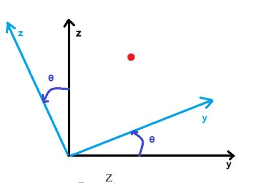
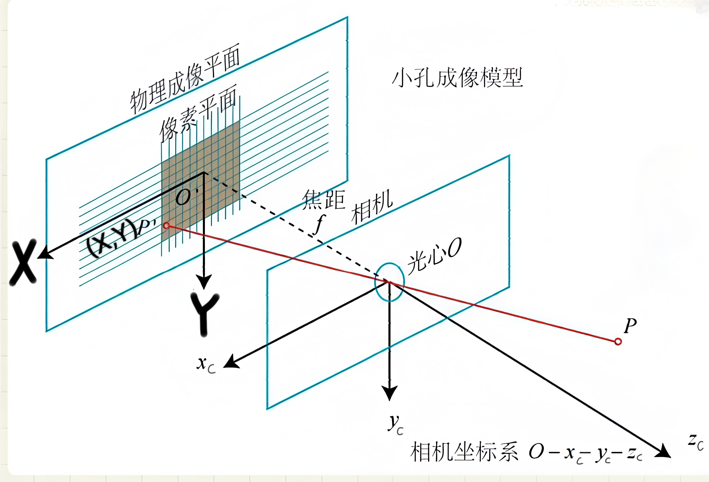
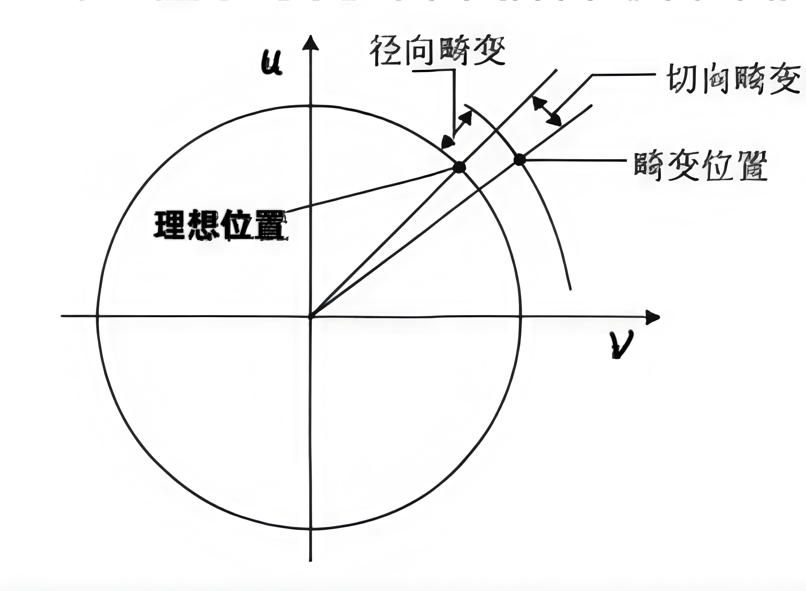
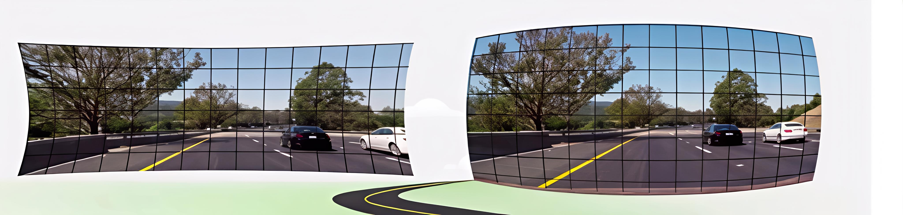
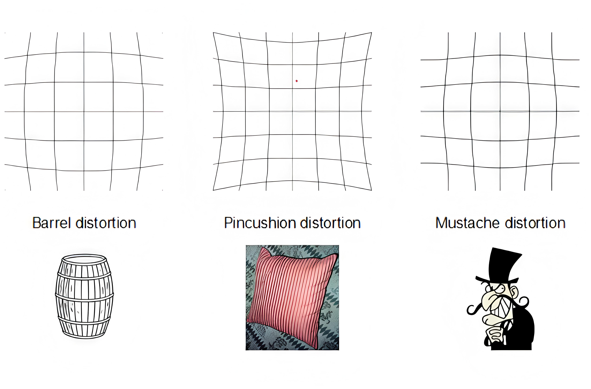
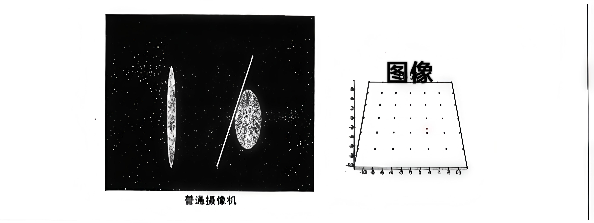
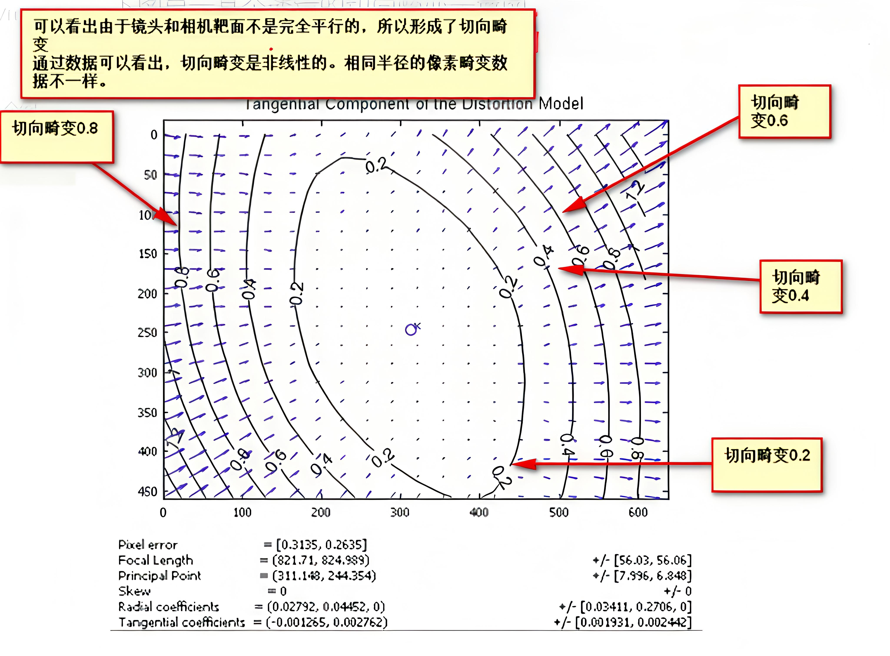

# 
张正友相机标定法

## 
YinKang'an

# 1.坐标系转换

## 相机标定是什么
- 空间物体表面某点的三维几何位置与其在图像中对应点的二维图像坐标之间的关系,必须建立相互关系,必须建立相机成像的几何模型
- 这些几何模型参数称相机的参数
- 求解相机参数的过程称为相机标定
## 世界坐标系与相机坐标系
- **世界坐标系**
  - 由于摄像机与被摄像可以放置在环境中的任意位置,这样就需要在环境中建立一个参考坐标系,来表示摄像机和被摄像物体的位置,这个坐标系称为世界坐标系
- **相机坐标系**
  - 也是一个三维直角坐标系,原点位于镜头光心,x轴指向相机向右,y轴指向相机向上,z轴指向相机前方
## 世界坐标系到相机坐标系的转换
**1. 旋转**
  - 旋转的表示有很多:
    - 旋转矩阵
    - 欧拉角
    - 四元数
    - 轴角
    - 李群与李代数
- 先旋转对齐,再平移回去

$$\begin{aligned}
& X_c=X \\
& Y c=\cos \theta \cdot Y+\sin \theta \cdot Z \\
& Z c=-\sin \theta \cdot Y+\cos \theta \cdot Z
\end{aligned}$$

$$\left[\begin{array}{c}
X_c \\
Y_c \\
Z_c
\end{array}\right]=\left[\begin{array}{ccc}
1 & 0 & 0 \\
0 & \cos \theta & \sin \theta \\
0 & -\sin \theta & \cos \theta
\end{array}\right]\left[\begin{array}{c}
X \\
Y \\
Z
\end{array}\right]$$

验证方法:所有的分解都满足**欧式距离不变性**
$$a_1{ }^2+a_2{ }^2+\cdots+a_n{ }^2=b_1{ }^2+b_2{ }^2+\cdots+b_n{ }^2$$

绕坐标轴旋转矩阵
$$\boldsymbol{R}(X_A, \theta) = \begin{bmatrix}
1 & 0 & 0 \\
0 & \cos\theta & -\sin\theta \\
0 & \sin\theta & \cos\theta
\end{bmatrix}$$

$$\boldsymbol{R}(Y_A, \theta) = \begin{bmatrix}
\cos\theta & 0 & -\sin\theta \\
0 & 1 & 0 \\
\sin\theta & 0 & \cos\theta
\end{bmatrix}$$

$$\boldsymbol{R}(Z_A, \theta) = \begin{bmatrix}
\cos\theta & -\sin\theta & 0 \\
\sin\theta & \cos\theta & 0 \\
0 & 0 & 1
\end{bmatrix}$$

所以将上面的旋转矩阵**连续左乘**,就得到了从世界坐标系到相机坐标系的旋转矩阵
$$\begin{aligned}
& {\left[{ }^A \operatorname{RPY}_B(\phi, \theta, \psi)\right]=\boldsymbol{R}\left(Z_A, \varphi\right) \boldsymbol{R}\left(Y_A, \theta\right) \boldsymbol{R}\left(X_A, \psi\right)} \\
& =\left[\begin{array}{ccc}
c \varphi s \theta & c \varphi s \theta s \psi-s \varphi c \psi & c \varphi s \theta c \psi+s \varphi s \psi \\
c \varphi c \theta & s \varphi s \theta s \psi+c \varphi c \psi & s \varphi s \theta c \psi-c \varphi s \psi \\
-s \theta & c \theta s \psi & c \theta c \psi
\end{array}\right]
\end{aligned}$$

补充:
- 左乘还是右乘
  - 左乘——相对于固定坐标系进行变换
  固定坐标系=变换*需变换坐标系
  (x2, y2) = A * (x1, y1)

  - 右乘——相对于自身(活跃)坐标系进行变换
  固定坐标系=需变换坐标系*变换
  (x2, y2) = (x1, y1) * A

旋转的左乘与右乘:[点击进入链接][旋转的左乘与右乘]

[旋转的左乘与右乘]:https://zhuanlan.zhihu.com/p/128155013

**2. 旋转+平移**

向量形式
$$\begin{bmatrix}
X_c \\
Y_c \\
Z_c
\end{bmatrix}
=R
\begin{bmatrix}
X_w \\
Y_w \\
Z_w
\end{bmatrix}+T$$

$$\begin{bmatrix}
X_c \\
Y_c \\
Z_c
\end{bmatrix}=\begin{bmatrix}
r_{11} & r_{12} & r_{13} \\
r_{21} & r_{22} & r_{23} \\
r_{31} & r_{32} & r_{33}
\end{bmatrix}
\begin{bmatrix}
X_W \\
Y_W \\
Z_W
\end{bmatrix}+\begin{bmatrix}
t_x \\
t_y \\
t_z
\end{bmatrix}$$

R,t 为相机外参(Camera Extrinsics)

齐次坐标形式

$$\begin{bmatrix}
x_c \\
y_c \\
z_c \\
1
\end{bmatrix}=\begin{bmatrix}
\boldsymbol{R} & \boldsymbol{t} \\
\boldsymbol{0} & 1
\end{bmatrix}
\begin{bmatrix}
x_w \\
y_w \\
z_w \\
1\end{bmatrix}$$

**总结:** 
- 为啥要把世界坐标系变到相机坐标系？因为我们相机坐标系可以将图像的世界点联系起来。
- 啥是世界点？一般情况下我们是需要测量物体到机器人的距离和位置关系，因此世界坐标系一般定在基座不动机器人上，或者是机器人工作的场景中。
- **世界坐标系与相机坐标系的关系就是相机的外参**

# 2.相机坐标系到世界坐标系与畸变

## 像素坐标系与图像坐标系
- **像素坐标系**
  - 像素坐标系uov是二维直角坐标系,反映了相机CCD/CMOS传感器的像素排列情况
  - 原点o在相机CCD/CMOS传感器的左上角,水平方向为u轴,垂直方向为v轴
  - 像素坐标系中坐标轴单位为像素(pixel),即一个像素为一个单位
- **图像坐标系**
  - 像素坐标系不利于坐标变换,因此需要建立图像坐标系XOY
  - 其坐标轴的单位通常为毫米(mm),原点是相机光轴与相面的交点(称为主点),即图像的中心点
  - X轴,Y轴分别与u轴,v轴平行.故两个坐标系实际是平移关系,即可以通过平移就可得到
## 图像坐标系转换为像素坐标系

$$\begin{bmatrix}
u \\
v \\
1
\end{bmatrix}=\begin{bmatrix}
1/dX & 0 & u_0 \\
0 & 1/dY & v_0 \\
0 & 0 & 1
\end{bmatrix}
\begin{bmatrix}
X \\
Y \\
1
\end{bmatrix}
$$

其中$dX$,$dY$分别为像素在$X$,$Y$轴方向上的物理尺寸,$u_0, v_0$ 为主点(图像原点)坐标
 
公式$ u = \frac{X}{dX} + u_0 $的含义:物理坐标$X$除以单个像素的物理尺寸$dX$得到像素数，再加上主点在像素坐标系中的水平偏移量 $u_0$，即可得到该点在像素坐标系下的水平坐标 $u$

## 针孔成像原理

空间任意一点 $P$ 与其图像点 $p'$ 之间的关系，$P$ 与相机光心 $O$ 的连线为 $OP$，$OP$ 与像面的交点 $p'$ 即为空间点 $P$ 在图像坐标系上的投影。

该过程为透视投影，如下矩阵表示：

$$
s
\begin{bmatrix}
X \\
Y \\
1
\end{bmatrix}=\begin{bmatrix}
f & 0 & 0 & 0 \\
0 & f & 0 & 0 \\
0 & 0 & 1 & 0
\end{bmatrix}
\begin{bmatrix}
x_c \\
y_c \\
z_c \\
1
\end{bmatrix}
$$

其中，$s$ 为比例因子（$s$ 不为0），$f$ 为有效焦距（光心到图像坐标系的距离），$(x_c,y_c,z_c,1)^T$ 是空间点 $P$ 在相机坐标系 $O-x_c-y_c-z_c$ 中的齐次坐标，$(X,Y,1)^T$ 是像点 $p'$ 在图像物理坐标系 $O'-X-Y$ 中的齐次坐标。

## 世界坐标系转换为像素坐标系
- **世界坐标系到相机坐标系**
$$\begin{bmatrix}
x_c \\
y_c \\
z_c \\
1
\end{bmatrix}=\begin{bmatrix}
\boldsymbol{R} & \boldsymbol{t} \\
\boldsymbol{0} & 1
\end{bmatrix}
\begin{bmatrix}
x_w \\
y_w \\
z_w \\
1\end{bmatrix}$$

- **相机坐标系到图像坐标系**
$$
s
\begin{bmatrix}
X \\
Y \\
1
\end{bmatrix}=\begin{bmatrix}
f & 0 & 0 & 0 \\
0 & f & 0 & 0 \\
0 & 0 & 1 & 0
\end{bmatrix}
\begin{bmatrix}
x_c \\
y_c \\
z_c \\
1
\end{bmatrix}
$$

- **图像坐标系到像素坐标系**
$$\begin{bmatrix}
u \\
v \\
1
\end{bmatrix}=\begin{bmatrix}
1/dX & 0 & u_0 \\
0 & 1/dY & v_0 \\
0 & 0 & 1
\end{bmatrix}
\begin{bmatrix}
X \\
Y \\
1
\end{bmatrix}
$$

- **世界坐标系到像素坐标系**
$$\therefore
s\begin{bmatrix}u \\ v \\ 1\end{bmatrix}=
\begin{bmatrix}
1/dX & 0 & u_0 \\
0 & 1/dY & v_0 \\
0 & 0 & 1
\end{bmatrix}
\begin{bmatrix}
f & 0 & 0 & 0 \\
0 & f & 0 & 0 \\
0 & 0 & 1 & 0
\end{bmatrix}
\begin{bmatrix}
\mathbf{R} & \mathbf{t} \\
\mathbf{0} & 1
\end{bmatrix}
\begin{bmatrix}
x_w \\
y_w \\
z_w \\
1
\end{bmatrix}
$$

$$
=\begin{bmatrix}
\alpha_x & 0 & u_0 & 0 \\
0 & \alpha_y & v_0 & 0 \\
0 & 0 & 1 & 0
\end{bmatrix}
\begin{bmatrix}
\mathbf{R} & \mathbf{t} \\
\mathbf{0} & 1
\end{bmatrix}
\begin{bmatrix}
x_w \\
y_w \\
z_w \\
1
\end{bmatrix}
= \mathbf{M}_1\mathbf{M}_2\mathbf{X}_w = \mathbf{M}\mathbf{X}_w
$$

其中 $\alpha_x = f/dX$,$\alpha_y = f/dY$,称为 $u$、$v$ 轴的尺度因子, $\mathbf{M}_1$ 称为相机的内部参数矩阵,$\mathbf{M}_2$ 称为相机的外部参数矩阵, $\mathbf{M}$ 称为投影矩阵

## 畸变参数(distortion parameter)
 
- 在几何光学和阴极射线管(CRT)显示中，畸变（distortion）是对直线投影（rectilinear projection）的一种偏移。
- 简单来说直线投影是场景内的一条直线投影到图片上也保持为一条直线
- 那畸变简单来说就是一条直线投影到图片上不能保持为一条直线了，这是一种光学畸变（optical aberration）
- 畸变一般可以分为两大类，包括径向畸变和切向畸变。主要的一般径向畸变有时也会有轻微的切向畸变。
  
- 畸变一般可以分为：径向畸变、切向畸变
- 径向畸变来自于透镜形状
- 切向畸变来自于整个摄像机的组装过程
- 畸变还有其他类型的畸变，但是没有径向畸变、切向畸变显著

径向畸变（Radial distortion）

- 实际摄像机的透镜总是在成像仪的边缘产生显著的畸变，这种现象来源于“筒形”或“鱼眼”的影响。
- 光线在远离透镜中心的地方比靠近中心的地方更加弯曲。对于常用的普通透镜来说，这种现象更加严重。

对于径向畸变，成像仪中心（光学中心）的畸变为0，随着向边缘移动，畸变越来越严重 
 

径向畸变有三种：
- 桶形畸变（barrel distortion）
- 枕形畸变（pincushion distortion）
- 胡子畸变（mustache distortion）
 
 
 
切向畸变

- 切向畸变是由于透镜制造上的缺陷使得透镜本身与图像平面不平行而产生的。
- 切向畸变可分为：薄透镜畸变、离心畸变

切向畸变图示：

 
当透镜不完全平行于图像平面时候产生切向畸变

 
 
