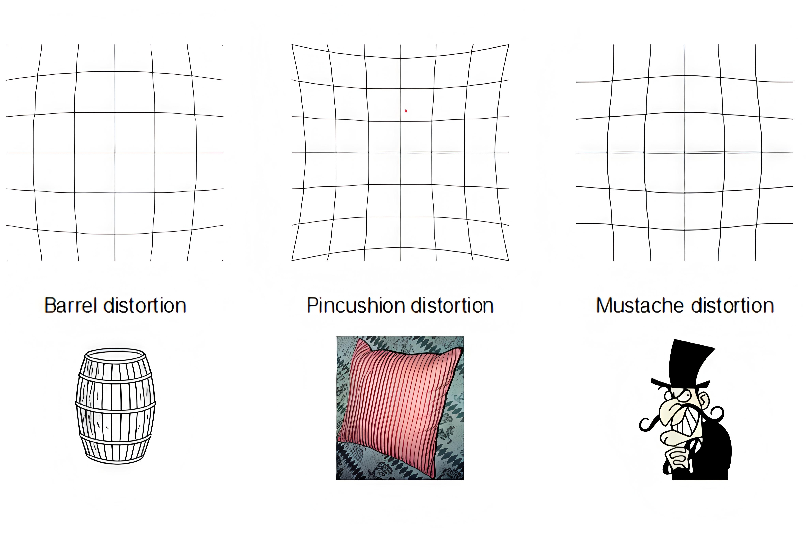

# <center><font face="黑体" font color=orange size=10>张正友相机标定法</font></center>
## <center><font face="黑体" size=5 font color=cyan>YinKang'an</font></center>

## 第一章：相机标定基础理论

### 1.1 相机标定的本质与意义

#### 1.1.1 基本定义
**相机标定**是通过数学建模确定相机内部几何和光学特性参数的过程。这些参数描述了三维空间点与其在二维图像平面上投影点之间的精确映射关系。

#### 1.1.2 核心数学模型
相机成像过程可抽象为：
$$
\mathbf{x}_{\text{pixel}} = \mathcal{P}(\mathbf{X}_{\text{world}}; \mathbf{\Theta})
$$
其中：
- $\mathbf{X}_{\text{world}} \in \mathbb{R}^3$：世界坐标系中的三维点
- $\mathbf{x}_{\text{pixel}} \in \mathbb{R}^2$：像素坐标系中的二维点
- $\mathcal{P}$：投影函数（包含透视投影+畸变）
- $\mathbf{\Theta}$：待标定的相机参数集合

#### 1.1.3 参数分类详解

| 参数类型 | 符号 | 数量 | 物理意义 | 是否随相机移动变化 |
|---------|------|------|----------|-------------------|
| **内参** | $f_x, f_y$ | 2 | 焦距（像素单位） | 否 |
| | $u_0, v_0$ | 2 | 主点坐标 | 否 |
| | $\gamma$ | 1 | 像素倾斜系数 | 否 |
| | $k_1, k_2, k_3$ | 3 | 径向畸变系数 | 否 |
| | $p_1, p_2$ | 2 | 切向畸变系数 | 否 |
| **外参** | $R$（3自由度） | 3 | 旋转矩阵 | 是 |
| | $t$ | 3 | 平移向量 | 是 |

**总计**：内参最多10个，外参每张图6个

#### 1.1.4 标定方法演进史
```
传统方法（1980s前）  
├── 直接线性变换（DLT）
├── Tsai两步法
└── 基于3D标定物的方法

张正友方法（1999）
├── 仅需平面标定板
├── 鲁棒性好
└── 精度高

现代方法（2000s后）
├── 自标定
├── 在线标定
└── 深度学习标定
```


## 第二章：多坐标系系统与转换链

### 2.1 四大坐标系的深度解析

#### 2.1.1 世界坐标系（World Coordinate System, WCS）
**定义**：$\{O_w; X_w, Y_w, Z_w\}$
- **原点** $O_w$：可任意指定，通常选在标定板一角或场景显著点
- **坐标轴**：构成右手直角坐标系
- **单位**：通常为毫米（mm）或米（m）

**工程实践**：
```cpp
// 在世界坐标系中定义棋盘格角点
// 假设棋盘格尺寸为30mm×30mm，角点数为9×6
std::vector<cv::Point3f> createWorldPoints(cv::Size boardSize, float squareSize) {
    std::vector<cv::Point3f> points;
    for (int i = 0; i < boardSize.height; i++) {
        for (int j = 0; j < boardSize.width; j++) {
            // Z_w = 0（棋盘平面）
            points.push_back(cv::Point3f(j * squareSize, i * squareSize, 0.0f));
        }
    }
    return points;
}
```

#### 2.1.2 相机坐标系（Camera Coordinate System, CCS）
**定义**：$\{O_c; X_c, Y_c, Z_c\}$
- **原点** $O_c$：相机光心（透镜中心）
- $Z_c$轴：沿光轴指向拍摄方向
- $X_c$轴：平行于图像平面水平向右
- $Y_c$轴：平行于图像平面垂直向下（注意：与像素坐标系v轴同向）

**几何意义**：
$$
\begin{aligned}
O_c &: \text{所有入射光线的交点} \\
Z_c &: \text{深度方向，决定透视效果} \\
(X_c, Y_c) &: \text{成像平面的物理坐标}
\end{aligned}
$$

#### 2.1.3 图像坐标系（Image Coordinate System, ICS）
**定义**：$\{O_i; X, Y\}$
- **原点** $O_i$：光轴与像平面交点（主点）
- **单位**：物理单位（mm）
- **与CCS关系**：$Z_c = f$平面上的投影

**转换公式**：
$$
\begin{cases}
X = f \cdot \dfrac{X_c}{Z_c} \\
Y = f \cdot \dfrac{Y_c}{Z_c}
\end{cases}
$$
其中$f$为物理焦距（mm）。

#### 2.1.4 像素坐标系（Pixel Coordinate System, PCS）
**定义**：$\{O_p; u, v\}$
- **原点** $O_p$：图像左上角（惯例）
- **单位**：像素（pixel）
- **与ICS关系**：仿射变换

**传感器特性**：
```
CMOS/CCD传感器结构：
┌─────────────────┐
│    u            │
│  ←---→          │
│  +-----------+  │
│  │           │  │
│  │  像素阵列  │  │ v
│  │           │  │ ↓
│  +-----------+  │
│                 │
│ dX: 像素宽度     │
│ dY: 像素高度     │
└─────────────────┘
```

### 2.2 完整转换链的数学推导

#### 2.2.1 世界→相机：刚体变换
**基本原理**：欧几里得运动 = 旋转 + 平移

**旋转矩阵的深层理解**：
1. **正交性**：$R^T R = I$，$\det(R) = 1$
2. **自由度**：3个（可用欧拉角、轴角、四元数表示）
3. **物理意义**：相机相对于世界坐标系的姿态

**详细推导**：
设世界点 $P_w = [X_w, Y_w, Z_w]^T$，相机点 $P_c = [X_c, Y_c, Z_c]^T$

$$
P_c = R \cdot P_w + t
$$

**齐次坐标形式**（便于矩阵连乘）：
$$
\begin{bmatrix}
X_c \\ Y_c \\ Z_c \\ 1
\end{bmatrix}=\begin{bmatrix}
R_{3\times3} & t_{3\times1} \\
0_{1\times3} & 1
\end{bmatrix}
\begin{bmatrix}
X_w \\ Y_w \\ Z_w \\ 1
\end{bmatrix}
\triangleq M_{\text{ext}} \cdot \tilde{P}_w
$$

其中 $M_{\text{ext}} \in \mathbb{R}^{4\times4}$ 为外参矩阵。

#### 2.2.2 相机→图像：透视投影

**针孔相机模型几何**：

相似三角形关系：
$$\frac{X}{f} =\frac{X_c}{Z_c}$$
$$\frac{Y}{f} =\frac{Y_c}{Z_c}$$
由于相机坐标系与图像坐标系的y轴都向下,所以负号抵消


<center></center>

空间任意一点 $P$ 与其图像点 $p'$ 之间的关系，$P$ 与相机光心 $O$ 的连线为 $OP$, $OP$ 与像面的交点 $p'$ 即为空间点 $P$ 在图像坐标系上的投影


**投影矩阵形式**：
$$
s \begin{bmatrix} X \\ Y \\ 1 \end{bmatrix}
=\begin{bmatrix}
f & 0 & 0 & 0 \\
0 & f & 0 & 0 \\
0 & 0 & 1 & 0
\end{bmatrix}
\begin{bmatrix}
X_c \\ Y_c \\ Z_c \\ 1
\end{bmatrix}
$$

**关键洞察**：比例因子 $s = Z_c$ 不是随意引入的，而是投影的必然结果。

#### 2.2.3 图像→像素：仿射变换

**传感器参数的实际意义**：
- $dX, dY$：单个像素的物理尺寸（mm/pixel）
- $u_0, v_0$：主点在像素坐标系中的坐标
- $\gamma$：像素倾斜系数（通常为0，表示像素行列正交）

**变换矩阵**：
$$
\begin{bmatrix}
u \\ v \\ 1
\end{bmatrix}=\begin{bmatrix}
\frac{1}{dX} & \gamma & u_0 \\
0 & \frac{1}{dY} & v_0 \\
0 & 0 & 1
\end{bmatrix}
\begin{bmatrix}
X \\ Y \\ 1
\end{bmatrix}
$$

**特殊情况**：
- 当 $\gamma = 0$ 且 $dX = dY$ 时：像素是正方形的
- 当 $u_0 = \frac{\text{width}}{2}, v_0 = \frac{\text{height}}{2}$ 时：主点在图像中心

#### 2.2.4 完整投影矩阵

**组合所有变换**：
$$
s \begin{bmatrix} u \\ v \\ 1 \end{bmatrix}=\underbrace{
\begin{bmatrix}
\frac{f}{dX} & \gamma & u_0 \\
0 & \frac{f}{dY} & v_0 \\
0 & 0 & 1
\end{bmatrix}
}_{K \text{（内参矩阵）}}
\underbrace{
\begin{bmatrix}
R & t
\end{bmatrix}
}_{[R|t] \text{（外参矩阵）}}
\begin{bmatrix}
X_w \\ Y_w \\ Z_w \\ 1
\end{bmatrix}
$$

**简化记法**：
$$
\begin{aligned}
\alpha_x &= f/dX \quad \text{(x轴尺度因子)} \\
\alpha_y &= f/dY \quad \text{(y轴尺度因子)} \\
K &= \begin{bmatrix}
\alpha_x & \gamma & u_0 \\
0 & \alpha_y & v_0 \\
0 & 0 & 1
\end{bmatrix} \in \mathbb{R}^{3\times3}
\end{aligned}
$$

**最终投影方程**：
$$
\lambda \begin{bmatrix} u \\ v \\ 1 \end{bmatrix}
= K \cdot [R | t] \cdot \begin{bmatrix} X_w \\ Y_w \\ Z_w \\ 1 \end{bmatrix}
$$

其中 $\lambda = Z_c$ 为深度值。

### 2.3 深度值（λ）的物理意义探究

#### 2.3.1 为什么深度信息"似乎丢失"了？
在投影方程中，三维点 $[X_w, Y_w, Z_w]^T$ 被映射到二维点 $[u, v]^T$，表面上丢失了深度信息。但实际上：

**深度被编码在λ中**：
$$
\lambda = Z_c = r_{31}X_w + r_{32}Y_w + r_{33}Z_w + t_z
$$

**实际意义**：
1. **透视效果**：λ越大（点越远），投影点越靠近主点
2. **可恢复性**：在立体视觉中，通过多视角可恢复深度

#### 2.3.2 齐次坐标的归一化过程
```
原始投影：λ[u, v, 1]^T = K[R|t][X_w, Y_w, Z_w, 1]^T

计算步骤：
1. 计算齐次坐标：h = K[R|t]X̃
   h = [h1, h2, h3]^T
2. 归一化：u = h1/h3, v = h2/h3
3. λ = h3（正好等于Z_c）
```

**数学验证**：
设 $h = K[R|t]X̃ = [h_1, h_2, h_3]^T$，则：
$$
\begin{cases}
u = h_1 / h_3 \\
v = h_2 / h_3 \\
\lambda = h_3
\end{cases}
$$

由于 $h_3 = [0, 0, 1] \cdot K \cdot [R|t] \cdot X̃$，且 $K$ 的第三行为 $[0, 0, 1]$，可得：
$$
h_3 = [r_{31}, r_{32}, r_{33}, t_z] \cdot [X_w, Y_w, Z_w, 1]^T = Z_c
$$


## 第三章：镜头畸变理论与建模

### 3.1 畸变现象的物理起源

#### 3.1.1 理想vs实际镜头
```
理想薄透镜模型：
光线直线传播 → 完美透视投影

实际厚透镜系统：
光线弯曲 → 非线性畸变
原因：
1. 透镜曲率不均匀
2. 多透镜组装配误差
3. 传感器倾斜
```

#### 3.1.2 畸变分类学

| 畸变类型 | 原因 | 数学特性 | 视觉表现 |
|---------|------|----------|----------|
| **径向畸变** | 透镜曲率 | 径向对称 | 直线变曲线 |
| **切向畸变** | 透镜-传感器不平行 | 切向偏移 | 图像倾斜 |
| **薄透镜畸变** | 透镜厚度 | 高阶非线性 | 复杂变形 |
| **色差** | 波长依赖性 | 颜色相关 | 彩色边缘 |

### 3.2 径向畸变（Radial Distortion）

#### 3.2.1 产生机制

<center></center>

- 实际摄像机的透镜总是在成像仪的边缘产生显著的畸变,这种现象来源于"筒形"或"鱼眼"的影响.
- 光线在远离透镜中心的地方比靠近中心的地方更加弯曲.对于常用的普通透镜来说,这种现象更加严重.

#### 3.2.2 数学模型
设无畸变坐标为 $(x_u, y_u)$，有畸变坐标为 $(x_d, y_d)$，图像中心为 $(x_c, y_c)$。

定义归一化坐标：
$$
\begin{aligned}
\hat{x} &= (x_d - x_c) / f_x \\
\hat{y} &= (y_d - y_c) / f_y \\
r &= \sqrt{\hat{x}^2 + \hat{y}^2}
\end{aligned}
$$

**径向畸变公式**：
$$
\begin{cases}
x_u = \hat{x} \cdot (1 + k_1 r^2 + k_2 r^4 + k_3 r^6) \\
y_u = \hat{y} \cdot (1 + k_1 r^2 + k_2 r^4 + k_3 r^6)
\end{cases}
$$

各阶系数物理意义
```
k₁ (二阶项)：主导项，控制基本畸变形状
  k₁ > 0 → 枕形畸变（pincushion）
  k₁ < 0 → 桶形畸变（barrel）

k₂ (四阶项)：修正边缘区域
  通常与k₁符号相反

k₃ (六阶项)：精细修正
  通常很小，有时可忽略
```

#### 3.2.3 可视化理解

<center></center>

### 3.3 切向畸变（Tangential Distortion）

#### 3.3.1 产生机制

<center></center>

- 切向畸变是由于透镜制造上的缺陷使得透镜本身与图像平面不平行而产生的
- 切向畸变可分为:薄透镜畸变、离心畸变


#### 3.3.2 数学模型
$$
\begin{cases}
x_u = \hat{x} + [2p_1\hat{x}\hat{y} + p_2(r^2 + 2\hat{x}^2)] \\
y_u = \hat{y} + [p_1(r^2 + 2\hat{y}^2) + 2p_2\hat{x}\hat{y}]
\end{cases}
$$

#### 3.3.3 系数解释
- $p_1$：控制y方向倾斜
- $p_2$：控制x方向倾斜
- 通常 $|p_1|, |p_2| \ll |k_1|$（切向畸变更小）

### 3.4 完整畸变模型

#### 3.4.1 组合公式
$$
\begin{cases}
x_{\text{corrected}} = x_d \cdot (1 + k_1 r^2 + k_2 r^4 + k_3 r^6) \\
\quad + [2p_1 x_d y_d + p_2(r^2 + 2x_d^2)] \\
y_{\text{corrected}} = y_d \cdot (1 + k_1 r^2 + k_2 r^4 + k_3 r^6) \\
\quad + [p_1(r^2 + 2y_d^2) + 2p_2 x_d y_d]
\end{cases}
$$

#### 3.4.2 参数数量选择
```
常用配置：
1. 简单模型：k₁, k₂, p₁, p₂ （4参数）
2. 标准模型：k₁, k₂, k₃, p₁, p₂ （5参数）
3. 完整模型：k₁~k₆, p₁, p₂, s₁, s₂ （10+参数）
```

#### 3.4.3 畸变矫正流程

以下是摄像头畸变矫正的整个流程和其中的数学推导。这个过程本质上是将图像中由于镜头不完美而扭曲的点，恢复到它们“应该”在的、符合针孔相机模型的位置。

##### **核心思想**
畸变矫正的流程是 **“建模”** 和 **“反变换”** 的结合：
1.  **建模**：用一个数学模型（畸变模型）来描述镜头是如何扭曲真实世界的坐标的。
2.  **反变换**：对于最终得到的**畸变图像**上的每一个像素点，我们利用已知的模型和相机参数，反向推算出“如果没有畸变，这个点原本应该来自图像平面的哪个位置”，然后通过插值得到该位置的像素值，从而生成一张矫正后的图像。

---

##### **第一步：建立坐标系与基础模型（无畸变）**

首先，我们需要理解理想情况下的成像几何——**针孔相机模型**。这里有四个关键的坐标系：

1.  **世界坐标系 (3D)**：点 \(P_w = (X_w, Y_w, Z_w)\)，真实世界中的点。
2.  **相机坐标系 (3D)**：点 \(P_c = (X_c, Y_c, Z_c)\)。原点在相机光心，Z轴指向拍摄方向。
    *   **转换关系**：通过**旋转矩阵R**和**平移向量t**（合称**外参**）。
      \[
      \begin{bmatrix} X_c \\ Y_c \\ Z_c \\ 1 \end{bmatrix} = \begin{bmatrix} R & t \\ 0 & 1 \end{bmatrix} \begin{bmatrix} X_w \\ Y_w \\ Z_w \\ 1 \end{bmatrix}
      \]

3.  **归一化相机平面 (2D)**：将3D相机坐标投影到 \(Z_c = 1\) 的平面上。
    *   **转换关系**：\( (x, y) = (X_c / Z_c, Y_c / Z_c) \)
    *   这里的 \( (x, y) \) 是**无物理单位**的归一化坐标。

4.  **像素坐标系 (2D)**：最终图像上的点 \(p = (u, v)\)，单位是像素。
    *   **转换关系**：通过**内参矩阵K**（包含焦距 \(f_x, f_y\) 和主点 \(c_x, c_y\)）。
      \[
      \begin{bmatrix} u \\ v \\ 1 \end{bmatrix} = \begin{bmatrix} f_x & 0 & c_x \\ 0 & f_y & c_y \\ 0 & 0 & 1 \end{bmatrix} \begin{bmatrix} x \\ y \\ 1 \end{bmatrix}
      \]
    *   在没有畸变的情况下，整个流程就是：**世界点 → (R,t) → 相机点 → 投影 → 归一化点 → (K) → 像素点**。

---

##### **第二步：引入畸变模型**

镜头畸变破坏了从**归一化坐标 \((x, y)\)** 到最终成像的线性关系。我们直接在归一化平面上对坐标进行修正。主要畸变类型有：

**1. 径向畸变**：由镜头形状引起，图像点沿径向向内（枕形畸变）或向外（桶形畸变）偏移。
*   **数学模型**（通常是泰勒级数展开）：
    \[
    \begin{align*}
    x_{distorted} &= x (1 + k_1 r^2 + k_2 r^4 + k_3 r^6 + ...) \\
    y_{distorted} &= y (1 + k_1 r^2 + k_2 r^4 + k_3 r^6 + ...)
    \end{align*}
    \]
    *   \(r^2 = x^2 + y^2\) （归一化平面上的点到中心的距离平方）
    *   \(k_1, k_2, k_3\) 是径向畸变系数。通常前两项 (\(k_1, k_2\)) 就足够。

**2. 切向畸变**：由镜头制造安装误差引起，透镜与成像平面不平行。
*   **数学模型**：
    \[
    \begin{align*}
    x_{distorted} &= x + [2p_1xy + p_2(r^2 + 2x^2)] \\
    y_{distorted} &= y + [p_1(r^2 + 2y^2) + 2p_2xy]
    \end{align*}
    \]
    *   \(p_1, p_2\) 是切向畸变系数。

**完整的畸变模型**是将两者叠加：
\[
\boxed{
\begin{aligned}
x_d &= x (1 + k_1 r^2 + k_2 r^4 + k_3 r^6) + (2p_1xy + p_2(r^2 + 2x^2)) \\
y_d &= y (1 + k_1 r^2 + k_2 r^4 + k_3 r^6) + (p_1(r^2 + 2y^2) + 2p_2xy)
\end{aligned}}
\]
其中 \((x, y)\) 是**理想的无畸变归一化坐标**，\((x_d, y_d)\) 是**实际有畸变的归一化坐标**。

---

##### **第三步：畸变矫正的完整数学流程（正向 vs 反向）**

**关键点**：当我们拿到一张**畸变图片**时，我们只知道每个像素点对应的是**畸变后的坐标** \((x_d, y_d)\) 或 \((u_d, v_d)\)。我们的目标是找到它对应的**无畸变坐标** \((x, y)\)，从而生成新的矫正图像。

这里有两种思考路径：

**A. 理想的正向过程（用于理解）**：
世界点 → 无畸变归一化坐标 \((x, y)\) → **施加畸变模型** → 有畸变归一化坐标 \((x_d, y_d)\) → 乘以内参K → 畸变图像像素 \((u_d, v_d)\)。

**B. 实际矫正的反向过程（用于操作）**：
我们只有畸变图像像素 \((u_d, v_d)\)。
1.  **通过内参K反向投影到归一化平面**：
    \[
    \begin{bmatrix} x_d \\ y_d \end{bmatrix} = \begin{bmatrix} (u_d - c_x)/f_x \\ (v_d - c_y)/f_y \end{bmatrix}
    \]
    现在我们有了 **有畸变的归一化坐标 \((x_d, y_d)\)**。

2.  **核心步骤：求解无畸变坐标 \((x, y)\)**。
    *   我们已知畸变模型方程：
        \[
        \begin{cases}
        x_d = f_x(x, y; k_1, k_2, p_1, p_2) \\
        y_d = f_y(x, y; k_1, k_2, p_1, p_2)
        \end{cases}
        \]
        （即第二步的完整模型）
    *   这是一个关于未知数 \((x, y)\) 的**非线性方程组**。因为 \(r^2 = x^2 + y^2\) 也包含 \(x, y\)。
    *   通常使用**迭代法**求解（如牛顿-拉夫森法）。初始值可以设 \(x^{(0)} = x_d, y^{(0)} = y_d\)，然后迭代更新直到收敛。
    *   **最终我们得到**对应这个畸变点 \((x_d, y_d)\) 的**无畸变归一化坐标 \((x, y)\)**。

3.  **重投影到矫正后的像素坐标系**：
    *   将求得的 \((x, y)\) 通过内参矩阵K映射到新的像素位置：
      \[
      \begin{bmatrix} u_{corrected} \\ v_{corrected} \end{bmatrix} = \begin{bmatrix} f_x * x + c_x \\ f_y * y + c_y \end{bmatrix}
      \]
    *   注意：\((u_{corrected}, v_{corrected})\) 很可能是**非整数**（例如 (152.3, 403.7)）。

4.  **像素值插值**：
    *   矫正图像上位置 \((u_{corrected}, v_{corrected})\) 的像素值，需要通过**原始畸变图像**中位置 \((u_d, v_d)\) 的像素值来填充。
    *   因为我们是反向映射（从目标图找原图），所以更准确的说法是：**对于矫正图像的每个整数像素位置 \((u’, v’)\)**，我们需要通过上述反向过程1-3，找到它在原始畸变图像上对应的位置 \((u_d, v_d)\)（通常也是非整数），然后使用**双线性插值**等方法从原始图像中计算出该位置的像素值，并赋给 \((u’, v’)\)。

---

##### **第四步：参数获取（相机标定）**

整个流程依赖于以下参数：
*   **内参矩阵K**：\(f_x, f_y, c_x, c_y\)
*   **畸变系数**：\(k_1, k_2, p_1, p_2, [k_3]\)

这些参数如何获得？通过 **相机标定**。
1.  使用一个已知精确尺寸的标定板（如棋盘格）。
2.  从多个角度拍摄标定板的照片。
3.  检测图像中的角点（得到像素坐标 \(p\)），并已知其世界坐标 \(P_w\)（假设Z=0）。
4.  构建一个巨大的非线性优化问题（如使用Levenberg-Marquardt算法），其**目标函数**是最小化**重投影误差**：
    \[
    \min_{K, dist, R_i, t_i} \sum_{i=1}^{n} \sum_{j=1}^{m} \| p_{ij} - \hat{p}(K, dist, R_i, t_i, P_{wj}) \|^2
    \]
    其中 \(\hat{p}(\cdot)\) 就是上述**理想的正向过程**，即用当前的估计参数将世界点 \(P_{wj}\) 投影到图像上，得到预测的像素坐标，然后与检测到的真实像素坐标 \(p_{ij}\) 比较。通过优化使两者的差异（误差）最小。

##### **总结流程**

1.  **标定**：采集数据 → 优化求解 → 得到 **K** 和 **畸变系数**。
2.  **矫正（对新图像）**：
    *   对于矫正输出图像的每一个目标像素 \((u’, v’)\)，
    *   将其视为理想像素坐标，通过**内参K的逆**映射到**假想的无畸变归一化坐标 \((x, y)\)**。
    *   利用**正向畸变模型**，将 \((x, y)\) 计算得到**有畸变的归一化坐标 \((x_d, y_d)\)**。
    *   通过**内参K**，将 \((x_d, y_d)\) 映射回**原始畸变图像中的像素坐标 \((u_d, v_d)\)**。
    *   由于 \((u_d, v_d)\) 通常是浮点数，在**原始畸变图像**上使用**插值**（如双线性）获取像素值。
    *   将该像素值赋给输出图像的 \((u’, v’)\)。

这个过程就是经典的 **“反向映射”** 畸变矫正，在OpenCV等库中（如 `cv::undistort` 或 `cv::initUndistortRectifyMap` + `cv::remap`）被高效实现。其数学核心就是求解从畸变空间到无畸变空间的逆变换。


## 第四章：张正友标定法深度解析

### 4.1 方法的核心创新

#### 4.1.1 与传统方法对比
| 方面 | 传统方法 | 张正友方法 |
|------|----------|------------|
| 标定物 | 3D精密靶标 | 2D平面棋盘 |
| 复杂度 | 高精度加工 | 普通打印 |
| 灵活性 | 固定场景 | 任意角度 |
| 成本 | 昂贵 | 几乎为零 |
| 精度 | 很高 | 足够多数应用 |

#### 4.1.2 关键洞察：平面约束的力量
设世界坐标 $Z_w = 0$（棋盘为平面），则投影方程简化为：

$$
\lambda \begin{bmatrix} u \\ v \\ 1 \end{bmatrix}
= K \begin{bmatrix} r_1 & r_2 & t \end{bmatrix}
\begin{bmatrix} X_w \\ Y_w \\ 1 \end{bmatrix}
$$

**维度降低的好处**：
- 从3D-2D映射 → 2D-2D映射
- 可用单应性矩阵描述
- 线性求解成为可能

### 4.2 单应性矩阵（Homography）理论

#### 4.2.1 单应性定义
对于平面到平面的投影，存在一个3×3矩阵 $H$ 使得：
$$
\lambda \mathbf{x}' = H \mathbf{x}
$$
其中 $\mathbf{x}, \mathbf{x}' \in \mathbb{P}^2$ 是二维齐次坐标。

#### 4.2.2 单应性矩阵的结构
从投影方程可知：
$$
H = K \begin{bmatrix} r_1 & r_2 & t \end{bmatrix}
= \begin{bmatrix} h_1 & h_2 & h_3 \end{bmatrix}
$$

**分解关系**：
$$
\begin{aligned}
h_1 &= K r_1 \\
h_2 &= K r_2 \\
h_3 &= K t
\end{aligned}
$$

#### 4.2.3 单应性矩阵自由度分析
**为什么是8自由度？**
1. $H \in \mathbb{R}^{3\times3}$：9个参数
2. 齐次坐标缩放不变性：$H \equiv \alpha H$，减1个自由度
3. 总计：9 - 1 = 8个自由度

**数学证明**：
设 $\mathbf{x}' = H\mathbf{x}$，对于任意 $\alpha \neq 0$：
$$
\alpha\mathbf{x}' = (\alpha H)\mathbf{x} = H(\alpha\mathbf{x})
$$
因此 $H$ 和 $\alpha H$ 表示相同的变换。

### 4.3 单应性矩阵估计

#### 4.3.1 线性求解方法
对于每对匹配点 $(x_i, y_i) \leftrightarrow (x_i', y_i')$，有：
$$
\begin{cases}
x_i' = \dfrac{h_{11}x_i + h_{12}y_i + h_{13}}{h_{31}x_i + h_{32}y_i + h_{33}} \\
y_i' = \dfrac{h_{21}x_i + h_{22}y_i + h_{23}}{h_{31}x_i + h_{32}y_i + h_{33}}
\end{cases}
$$

**转换为线性方程**：
$$
\begin{aligned}
&h_{11}x_i + h_{12}y_i + h_{13} - h_{31}x_i x_i' - h_{32}y_i x_i' - h_{33}x_i' = 0 \\
&h_{21}x_i + h_{22}y_i + h_{23} - h_{31}x_i y_i' - h_{32}y_i y_i' - h_{33}y_i' = 0
\end{aligned}
$$

#### 4.3.2 矩阵形式
对于 $n$ 对点，构造 $2n \times 9$ 矩阵 $A$：
$$
A = \begin{bmatrix}
x_1 & y_1 & 1 & 0 & 0 & 0 & -x_1 x_1' & -y_1 x_1' & -x_1' \\
0 & 0 & 0 & x_1 & y_1 & 1 & -x_1 y_1' & -y_1 y_1' & -y_1' \\
\vdots & \vdots & \vdots & \vdots & \vdots & \vdots & \vdots & \vdots & \vdots \\
x_n & y_n & 1 & 0 & 0 & 0 & -x_n x_n' & -y_n x_n' & -x_n' \\
0 & 0 & 0 & x_n & y_n & 1 & -x_n y_n' & -y_n y_n' & -y_n'
\end{bmatrix}
$$

求解 $A\mathbf{h} = 0$，其中 $\mathbf{h} = [h_{11}, h_{12}, h_{13}, h_{21}, h_{22}, h_{23}, h_{31}, h_{32}, h_{33}]^T$

#### 4.3.3 求解策略
1. **最小二乘法**：$\min \|A\mathbf{h}\|^2$，约束 $\|\mathbf{h}\| = 1$
2. **SVD分解**：$A = U \Sigma V^T$，$\mathbf{h}$ 是 $V$ 的最后一列
3. **归一化**：通常设 $h_{33} = 1$ 或 $\|\mathbf{h}\| = 1$

#### 4.3.4 鲁棒性增强
```python
def estimate_homography(points_src, points_dst, method='ransac'):
    """
    估计单应性矩阵（带鲁棒性处理）
    """
    # 数据归一化（提高数值稳定性）
    T1 = normalize_points(points_src)
    T2 = normalize_points(points_dst)
    
    points_src_norm = apply_transform(points_src, T1)
    points_dst_norm = apply_transform(points_dst, T2)
    
    if method == 'direct':
        # 直接线性变换
        H_norm = dlt_homography(points_src_norm, points_dst_norm)
    elif method == 'ransac':
        # RANSAC鲁棒估计
        H_norm = ransac_homography(points_src_norm, points_dst_norm)
    
    # 反归一化
    H = np.linalg.inv(T2) @ H_norm @ T1
    
    # 可选：非线性优化
    H_refined = refine_homography(H, points_src, points_dst)
    
    return H_refined
```

### 4.4 内参求解：核心约束推导

#### 4.4.1 旋转矩阵的正交性约束
从 $H = K[r_1, r_2, t]$ 可得：
$$
\begin{aligned}
r_1 &= K^{-1} h_1 / \lambda \\
r_2 &= K^{-1} h_2 / \lambda
\end{aligned}
$$
其中 $\lambda = 1/\|K^{-1}h_1\|$（尺度因子）。

**利用正交性**：
$$
\begin{cases}
r_1^T r_2 = 0 & \text{(正交)} \\
\|r_1\| = \|r_2\| = 1 & \text{(单位长度)}
\end{cases}
$$

#### 4.4.2 转换为内参约束
代入 $r_1, r_2$ 表达式：
$$
\begin{cases}
h_1^T K^{-T} K^{-1} h_2 = 0 \\
h_1^T K^{-T} K^{-1} h_1 = h_2^T K^{-T} K^{-1} h_2
\end{cases}
$$

**定义**：$B = K^{-T} K^{-1}$（对称正定矩阵）

则约束变为：
$$
\begin{cases}
h_1^T B h_2 = 0 \\
h_1^T B h_1 = h_2^T B h_2
\end{cases}
$$

#### 4.4.3 矩阵B的显式形式
设 $K = \begin{bmatrix}
f_x & \gamma & u_0 \\
0 & f_y & v_0 \\
0 & 0 & 1
\end{bmatrix}$，则：
$$
B = \begin{bmatrix}
\frac{1}{f_x^2} & -\frac{\gamma}{f_x^2 f_y} & \frac{v_0\gamma - u_0 f_y}{f_x^2 f_y} \\
-\frac{\gamma}{f_x^2 f_y} & \frac{\gamma^2}{f_x^2 f_y^2} + \frac{1}{f_y^2} & -\frac{\gamma(v_0\gamma - u_0 f_y)}{f_x^2 f_y^2} - \frac{v_0}{f_y^2} \\
\frac{v_0\gamma - u_0 f_y}{f_x^2 f_y} & -\frac{\gamma(v_0\gamma - u_0 f_y)}{f_x^2 f_y^2} - \frac{v_0}{f_y^2} & \frac{(v_0\gamma - u_0 f_y)^2}{f_x^2 f_y^2} + \frac{v_0^2}{f_y^2} + 1
\end{bmatrix}
$$

#### 4.4.4 向量化表示
令 $\mathbf{b} = [B_{11}, B_{12}, B_{22}, B_{13}, B_{23}, B_{33}]^T$

定义：
$$
v_{ij} = \begin{bmatrix}
h_{i1}h_{j1} \\
h_{i1}h_{j2} + h_{i2}h_{j1} \\
h_{i2}h_{j2} \\
h_{i3}h_{j1} + h_{i1}h_{j3} \\
h_{i3}h_{j2} + h_{i2}h_{j3} \\
h_{i3}h_{j3}
\end{bmatrix}
$$

则 $h_i^T B h_j = v_{ij}^T \mathbf{b}$

#### 4.4.5 构建线性方程组
对于每张标定图（一个单应矩阵 $H$），得到两个方程：
$$
\begin{bmatrix}
v_{12}^T \\
v_{11}^T - v_{22}^T
\end{bmatrix}
\mathbf{b} = 0
$$

对于 $n$ 张图，得到 $2n \times 6$ 方程组：
$$
V \mathbf{b} = 0
$$
其中 $V$ 是 $2n \times 6$ 矩阵。

#### 4.4.6 求解策略
1. **最小二乘解**：$\min \|V\mathbf{b}\|^2$，约束 $\|\mathbf{b}\| = 1$
2. **SVD求解**：$\mathbf{b}$ 是 $V^T V$ 的最小特征值对应特征向量
3. **最少图片数**：$2n \geq 6 \Rightarrow n \geq 3$（理论上）

### 4.5 从B恢复内参K

#### 4.5.1 闭式解公式
已知 $\mathbf{b} = [B_{11}, B_{12}, B_{22}, B_{13}, B_{23}, B_{33}]^T$，计算：

1. **尺度因子**：
   $$
   \lambda = B_{33} - \frac{B_{13}^2 + v_0(B_{12}B_{13} - B_{11}B_{23})}{B_{11}}
   $$

2. **主点坐标**：
   $$
   \begin{aligned}
   v_0 &= \frac{B_{12}B_{13} - B_{11}B_{23}}{B_{11}B_{22} - B_{12}^2} \\
   u_0 &= \frac{\gamma v_0}{f_y} - \frac{B_{13}f_x^2}{\lambda}
   \end{aligned}
   $$

3. **焦距**：
   $$
   \begin{aligned}
   f_x &= \sqrt{\frac{\lambda}{B_{11}}} \\
   f_y &= \sqrt{\frac{\lambda B_{11}}{B_{11}B_{22} - B_{12}^2}}
   \end{aligned}
   $$

4. **倾斜系数**：
   $$
   \gamma = -\frac{B_{12}f_x^2 f_y}{\lambda}
   $$

#### 4.5.2 数值稳定性考虑
```python
def B_to_K(B):
    """
    从B矩阵恢复内参K
    输入：B - 6维向量或对称矩阵
    输出：K - 3x3内参矩阵
    """
    # 确保B是对称矩阵形式
    if B.shape == (6,):
        B_mat = np.array([
            [B[0], B[1], B[3]],
            [B[1], B[2], B[4]],
            [B[3], B[4], B[5]]
        ])
    else:
        B_mat = B
    
    # 计算中间量
    B11, B12, B13 = B_mat[0,0], B_mat[0,1], B_mat[0,2]
    B22, B23, B33 = B_mat[1,1], B_mat[1,2], B_mat[2,2]
    
    # 1. 计算v0
    denom = B11 * B22 - B12**2
    if abs(denom) < 1e-10:
        raise ValueError("B矩阵奇异，无法求解内参")
    
    v0 = (B12 * B13 - B11 * B23) / denom
    
    # 2. 计算λ
    lambda_val = B33 - (B13**2 + v0 * (B12*B13 - B11*B23)) / B11
    
    # 3. 计算fx, fy
    fx = np.sqrt(lambda_val / B11)
    fy = np.sqrt(lambda_val * B11 / denom)
    
    # 4. 计算γ
    gamma = -B12 * fx**2 * fy / lambda_val
    
    # 5. 计算u0
    u0 = gamma * v0 / fy - B13 * fx**2 / lambda_val
    
    # 构建K矩阵
    K = np.array([
        [fx, gamma, u0],
        [0,   fy,    v0],
        [0,   0,     1]
    ])
    
    return K
```

### 4.6 外参求解

#### 4.6.1 旋转矩阵恢复
已知 $H = [h_1, h_2, h_3]$ 和 $K$，计算：

1. **尺度因子**：
   $$
   \lambda = \frac{1}{\|K^{-1}h_1\|} = \frac{1}{\|K^{-1}h_2\|}
   $$
   （理论上二者相等，取平均提高鲁棒性）

2. **旋转向量**：
   $$
   \begin{aligned}
   r_1 &= \lambda K^{-1} h_1 \\
   r_2 &= \lambda K^{-1} h_2 \\
   r_3 &= r_1 \times r_2
   \end{aligned}
   $$

3. **正交化处理**：
   由于噪声，$[r_1, r_2, r_3]$ 可能不严格正交，需进行正交化：
   ```python
   def orthonormalize_rotation(R_approx):
       # 奇异值分解正交化
       U, _, Vt = np.linalg.svd(R_approx)
       R = U @ Vt
       # 确保右手坐标系
       if np.linalg.det(R) < 0:
           R[:, 2] = -R[:, 2]
       return R
   ```

#### 4.6.2 平移向量
$$
t = \lambda K^{-1} h_3
$$

#### 4.6.3 完整外参矩阵
$$
M_{\text{ext}} = \begin{bmatrix} R & t \\ 0 & 1 \end{bmatrix}
$$

### 4.7 非线性优化（精炼）

#### 4.7.1 最大似然估计
假设观测噪声服从高斯分布，优化目标：
$$
\min \sum_{i=1}^{n} \sum_{j=1}^{m} \|\mathbf{x}_{ij} - \hat{\mathbf{x}}(K, R_i, t_i, \mathbf{X}_j)\|^2
$$
其中：
- $n$：图片数量
- $m$：每张图片角点数量
- $\mathbf{x}_{ij}$：观测到的像素坐标
- $\hat{\mathbf{x}}$：根据模型预测的像素坐标

#### 4.7.2 包含畸变的完整模型
$$
\hat{\mathbf{x}} = \text{project}(\text{distort}(\mathbf{x}_{\text{norm}}, \mathbf{d}), K)
$$
其中：
- $\mathbf{x}_{\text{norm}}$：归一化图像坐标
- $\text{distort}$：畸变函数
- $\mathbf{d}$：畸变参数向量
- $\text{project}$：投影到像素坐标

#### 4.7.3 LM优化算法实现
```python
def bundle_adjustment(initial_params, observations, points_3d):
    """
    光束法平差优化所有参数
    """
    def reprojection_error(params):
        # 解析参数
        K = params[:4]  # fx, fy, u0, v0
        dist = params[4:9]  # k1,k2,p1,p2,k3
        num_cameras = (len(params) - 9) // 6
        
        total_error = 0
        for i in range(num_cameras):
            # 提取第i个相机的外参
            rvec = params[9 + i*6 : 12 + i*6]
            tvec = params[12 + i*6 : 15 + i*6]
            
            R, _ = cv2.Rodrigues(rvec)
            
            # 投影所有点
            points_proj, _ = cv2.projectPoints(
                points_3d, rvec, tvec, K, dist
            )
            
            # 计算重投影误差
            error = np.sum((observations[i] - points_proj.reshape(-1,2))**2)
            total_error += error
            
        return total_error
    
    # 使用LM算法优化
    result = least_squares(
        reprojection_error,
        initial_params,
        method='lm',
        max_nfev=2000
    )
    
    return result.x
```

#### 4.7.4 优化技巧
1. **参数化**：
   - 旋转：使用罗德里格斯向量（3参数）而非矩阵（9参数）
   - 内参：直接优化 $f_x, f_y, u_0, v_0$ 而非矩阵元素

2. **初始化**：
   - 内参：使用闭式解作为初始值
   - 畸变：初始设为零
   - 外参：使用线性解作为初始值

3. **权重与鲁棒核函数**：
   ```python
   # 使用Huber损失函数减少异常值影响
   def huber_loss(residual, delta=1.0):
       abs_res = np.abs(residual)
       return np.where(abs_res <= delta, 
                       0.5 * residual**2,
                       delta * (abs_res - 0.5 * delta))
   ```

---

## 第五章：工程实践与实现细节

### 5.1 标定板设计与制作

#### 5.1.1 棋盘格规格
```
推荐配置：
- 方格尺寸：20-50mm（取决于工作距离）
- 方格数量：奇数×偶数（如7×10），避免对称性
- 颜色：高对比度（黑白最佳）
- 材质：哑光表面，减少反光
- 平整度：误差<0.1mm/m
```

#### 5.1.2 生成标定板图像
```python
def generate_checkerboard(width=7, height=10, square_size=30, 
                          margin=20, filename='checkerboard.png'):
    """
    生成棋盘格标定板图像
    """
    # 计算图像尺寸
    img_width = width * square_size + 2 * margin
    img_height = height * square_size + 2 * margin
    
    # 创建图像
    img = np.ones((img_height, img_width), dtype=np.uint8) * 255
    
    # 绘制棋盘格
    for i in range(height):
        for j in range(width):
            if (i + j) % 2 == 0:
                x1 = margin + j * square_size
                y1 = margin + i * square_size
                x2 = x1 + square_size
                y2 = y1 + square_size
                img[y1:y2, x1:x2] = 0
    
    # 保存图像
    cv2.imwrite(filename, img)
    print(f"棋盘格已保存为 {filename}")
    print(f"实际尺寸：{width*square_size/10:.1f}cm × {height*square_size/10:.1f}cm")
    
    return img
```

### 5.2 图像采集最佳实践

#### 5.2.1 采集方案设计
```
多角度覆盖策略：
俯仰角：-45° ～ +45°，间隔15°
偏航角：0° ～ 360°，间隔30°
距离：最近对焦距离 ～ 2倍最近距离
数量：15-20张（最少5张，推荐10+张）
```

#### 5.2.2 拍摄注意事项
1. **光照条件**：
   - 均匀漫射光，避免阴影
   - 避免强反光和高光
   - 保持色温一致

2. **对焦与曝光**：
   - 手动对焦，固定焦距
   - 手动曝光，避免自动调整
   - 使用三脚架减少抖动

3. **棋盘格摆放**：
   - 覆盖图像各个区域
   - 倾斜角度多样
   - 部分图像中棋盘格可不完整

#### 5.2.3 质量检查清单
```python
def check_calibration_images(images, board_size=(7,10)):
    """
    检查标定图像质量
    """
    criteria = (cv2.TERM_CRITERIA_EPS + cv2.TERM_CRITERIA_MAX_ITER, 30, 0.001)
    
    results = []
    for i, img in enumerate(images):
        gray = cv2.cvtColor(img, cv2.COLOR_BGR2GRAY)
        
        # 查找角点
        ret, corners = cv2.findChessboardCorners(gray, board_size, None)
        
        if ret:
            # 亚像素精确化
            corners_refined = cv2.cornerSubPix(
                gray, corners, (11,11), (-1,-1), criteria
            )
            
            # 计算角点质量指标
            quality = evaluate_corner_quality(gray, corners_refined)
            
            results.append({
                'image_idx': i,
                'detected': True,
                'num_corners': len(corners),
                'corner_quality': quality,
                'recommend': quality > 0.7
            })
        else:
            results.append({
                'image_idx': i,
                'detected': False,
                'recommend': False
            })
    
    return results
```

### 5.3 完整标定流程实现

#### 5.3.1 OpenCV实现
```python
import cv2
import numpy as np
import glob

def calibrate_camera_zhang(images_path, board_size=(9,6), square_size=25.0):
    """
    完整的张正友标定法实现
    """
    # 1. 准备世界坐标系中的角点
    objp = np.zeros((board_size[0]*board_size[1], 3), np.float32)
    objp[:,:2] = np.mgrid[0:board_size[0], 0:board_size[1]].T.reshape(-1,2)
    objp *= square_size
    
    # 存储点
    objpoints = []  # 3D点
    imgpoints = []  # 2D点
    images = []
    
    # 2. 读取并处理所有图像
    image_files = glob.glob(images_path)
    criteria = (cv2.TERM_CRITERIA_EPS + cv2.TERM_CRITERIA_MAX_ITER, 30, 0.001)
    
    for fname in image_files:
        img = cv2.imread(fname)
        gray = cv2.cvtColor(img, cv2.COLOR_BGR2GRAY)
        
        # 查找棋盘格角点
        ret, corners = cv2.findChessboardCorners(gray, board_size, None)
        
        if ret:
            # 亚像素精确化
            corners_refined = cv2.cornerSubPix(gray, corners, (11,11), (-1,-1), criteria)
            
            objpoints.append(objp)
            imgpoints.append(corners_refined)
            images.append(img)
            
            # 可视化（可选）
            cv2.drawChessboardCorners(img, board_size, corners_refined, ret)
            cv2.imshow('Corners', img)
            cv2.waitKey(500)
    
    cv2.destroyAllWindows()
    
    if len(objpoints) < 3:
        raise ValueError(f"至少需要3张有效图像，当前只有{len(objpoints)}张")
    
    # 3. 相机标定
    print(f"使用 {len(objpoints)} 张图像进行标定...")
    
    ret, K, dist, rvecs, tvecs = cv2.calibrateCamera(
        objpoints, imgpoints, gray.shape[::-1], None, None,
        flags=cv2.CALIB_FIX_PRINCIPAL_POINT |  # 可选固定某些参数
              cv2.CALIB_ZERO_TANGENT_DIST
    )
    
    # 4. 评估标定精度
    mean_error = evaluate_calibration_error(objpoints, imgpoints, 
                                           rvecs, tvecs, K, dist)
    
    # 5. 保存结果
    calibration_data = {
        'retval': ret,
        'camera_matrix': K,
        'dist_coeffs': dist,
        'rvecs': rvecs,
        'tvecs': tvecs,
        'image_size': gray.shape[::-1],
        'num_images': len(images),
        'reprojection_error': mean_error,
        'objpoints': objpoints,
        'imgpoints': imgpoints
    }
    
    return calibration_data

def evaluate_calibration_error(objpoints, imgpoints, rvecs, tvecs, K, dist):
    """
    计算重投影误差
    """
    total_error = 0
    total_points = 0
    
    for i in range(len(objpoints)):
        # 投影点
        imgpoints_proj, _ = cv2.projectPoints(
            objpoints[i], rvecs[i], tvecs[i], K, dist
        )
        
        # 计算误差
        error = cv2.norm(imgpoints[i], imgpoints_proj, 
                         cv2.NORM_L2) / len(imgpoints_proj)
        total_error += error
        total_points += 1
    
    mean_error = total_error / total_points
    print(f"平均重投影误差: {mean_error:.4f} 像素")
    
    return mean_error
```

#### 5.3.2 标定结果分析

```python
def analyze_calibration_results(calibration_data):
    """
    详细分析标定结果
    """
    K = calibration_data['camera_matrix']
    dist = calibration_data['dist_coeffs']
    error = calibration_data['reprojection_error']
    
    print("=" * 60)
    print("相机标定结果分析报告")
    print("=" * 60)
    
    print(f"\n1. 内参矩阵 K:")
    print(f"   fx = {K[0,0]:.2f} (像素)")
    print(f"   fy = {K[1,1]:.2f} (像素)")
    print(f"   主点 (u0, v0) = ({K[0,2]:.2f}, {K[1,2]:.2f})")
    if abs(K[0,1]) > 1e-3:
        print(f"   倾斜系数 γ = {K[0,1]:.6f}")
    
    print(f"\n2. 畸变系数:")
    if len(dist) >= 5:
        print(f"   径向畸变: k1={dist[0]:.6f}, k2={dist[1]:.6f}, k3={dist[4]:.6f}")
        print(f"   切向畸变: p1={dist[2]:.6f}, p2={dist[3]:.6f}")
    
    print(f"\n3. 标定质量指标:")
    print(f"   重投影误差: {error:.4f} 像素")
    print(f"   使用图像数: {calibration_data['num_images']}")
    
    print(f"\n4. 内参合理性检查:")
    # 检查主点位置
    u0, v0 = K[0,2], K[1,2]
    img_width, img_height = calibration_data['image_size']
    
    if abs(u0 - img_width/2) < img_width*0.1:
        print(f"   ✓ 主点u0接近图像中心 (偏差: {abs(u0 - img_width/2):.1f}像素)")
    else:
        print(f"   ⚠ 主点u0偏离中心较多 (偏差: {abs(u0 - img_width/2):.1f}像素)")
    
    # 检查焦距比
    fx_fy_ratio = K[0,0] / K[1,1]
    if 0.95 < fx_fy_ratio < 1.05:
        print(f"   ✓ 焦距比接近1 (fx/fy = {fx_fy_ratio:.3f})")
    else:
        print(f"   ⚠ 焦距比偏离1较多 (fx/fy = {fx_fy_ratio:.3f})")
    
    print(f"\n5. 建议:")
    if error < 0.5:
        print(f"   ✓ 标定质量优秀")
    elif error < 1.0:
        print(f"   ✓ 标定质量良好")
    elif error < 2.0:
        print(f"   ⚠ 标定质量一般，建议增加图像数量或改善图像质量")
    else:
        print(f"   ✗ 标定质量较差，需要重新采集图像")
    
    print("=" * 60)
```

### 5.4 标定结果验证与应用

#### 5.4.1 验证方法
1. **重投影可视化**：
   ```python
   def visualize_reprojection(original_img, objpoints, imgpoints, 
                             rvec, tvec, K, dist):
       """
       可视化重投影结果
       """
       # 投影点
       imgpoints_proj, _ = cv2.projectPoints(
           objpoints, rvec, tvec, K, dist
       )
       
       # 绘制
       img_display = original_img.copy()
       
       # 原始点（红色）
       for pt in imgpoints.reshape(-1, 2):
           cv2.circle(img_display, tuple(pt.astype(int)), 5, (0, 0, 255), -1)
       
       # 重投影点（绿色）
       for pt in imgpoints_proj.reshape(-1, 2):
           cv2.circle(img_display, tuple(pt.astype(int)), 3, (0, 255, 0), -1)
       
       # 连接线（蓝色）
       for pt1, pt2 in zip(imgpoints.reshape(-1, 2), 
                          imgpoints_proj.reshape(-1, 2)):
           cv2.line(img_display, 
                   tuple(pt1.astype(int)), 
                   tuple(pt2.astype(int)), 
                   (255, 0, 0), 1)
       
       # 计算并显示误差
       errors = np.linalg.norm(imgpoints - imgpoints_proj, axis=2)
       mean_error = np.mean(errors)
       
       cv2.putText(img_display, f"Mean error: {mean_error:.2f} px", 
                   (10, 30), cv2.FONT_HERSHEY_SIMPLEX, 0.7, (255, 255, 255), 2)
       
       return img_display
   ```

2. **三维重建测试**：
   ```python
   def test_3d_reconstruction(K, dist, image_size):
       """
       测试标定结果的三维重建能力
       """
       # 创建虚拟场景
       virtual_points = np.array([
           [0, 0, 0],
           [100, 0, 0],
           [0, 100, 0],
           [0, 0, 100]
       ], dtype=np.float32)
       
       # 定义两个相机位置
       R1 = np.eye(3)
       t1 = np.array([[0, 0, 500]]).T
       
       R2 = cv2.Rodrigues(np.array([0.1, 0.2, 0.3]))[0]
       t2 = np.array([[50, 30, 500]]).T
       
       # 投影到两个视图
       points1, _ = cv2.projectPoints(virtual_points, R1, t1, K, dist)
       points2, _ = cv2.projectPoints(virtual_points, R2, t2, K, dist)
       
       # 三角测量重建
       P1 = K @ np.hstack([R1, t1])
       P2 = K @ np.hstack([R2, t2])
       
       points_3d_reconstructed = []
       for (x1, y1), (x2, y2) in zip(points1.reshape(-1, 2), 
                                     points2.reshape(-1, 2)):
           # 线性三角测量
           A = np.array([
               x1 * P1[2,:] - P1[0,:],
               y1 * P1[2,:] - P1[1,:],
               x2 * P2[2,:] - P2[0,:],
               y2 * P2[2,:] - P2[1,:]
           ])
           
           _, _, Vt = np.linalg.svd(A)
           X = Vt[-1]
           X = X / X[3]  # 齐次坐标归一化
           points_3d_reconstructed.append(X[:3])
       
       # 计算重建误差
       reconstructed = np.array(points_3d_reconstructed)
       error = np.mean(np.linalg.norm(reconstructed - virtual_points, axis=1))
       
       print(f"三维重建测试:")
       print(f"  原始点: {virtual_points.shape}")
       print(f"  重建误差: {error:.2f} mm")
       
       return error < 10.0  # 误差小于10mm认为标定可用
   ```

#### 5.4.2 实际应用示例

1. **图像去畸变**：
   ```python
   def undistort_image(image, K, dist, balance=0.0):
       """
       图像去畸变
       balance: 0.0-1.0，控制保留多少有效区域
       """
       h, w = image.shape[:2]
       
       # 计算新的相机矩阵
       new_K, roi = cv2.getOptimalNewCameraMatrix(
           K, dist, (w, h), balance, (w, h)
       )
       
       # 去畸变
       dst = cv2.undistort(image, K, dist, None, new_K)
       
       # 裁剪ROI
       x, y, w_roi, h_roi = roi
       dst_cropped = dst[y:y+h_roi, x:x+w_roi]
       
       return dst_cropped, new_K
   ```

2. **增强现实应用**：
   ```python
   def augment_reality(image, K, dist, board_size, square_size):
       """
       在检测到的棋盘格上绘制虚拟物体
       """
       gray = cv2.cvtColor(image, cv2.COLOR_BGR2GRAY)
       ret, corners = cv2.findChessboardCorners(gray, board_size, None)
       
       if not ret:
           return image
       
       # 定义虚拟物体（金字塔）
       virtual_obj = np.array([
           [0, 0, 0],
           [square_size, 0, 0],
           [0, square_size, 0],
           [0, 0, square_size],
           [square_size/2, square_size/2, square_size*1.5]
       ], dtype=np.float32)
       
       # 求解外参
       objp = np.zeros((board_size[0]*board_size[1], 3), np.float32)
       objp[:,:2] = np.mgrid[0:board_size[0], 0:board_size[1]].T.reshape(-1,2)
       objp *= square_size
       
       ret, rvec, tvec = cv2.solvePnP(objp, corners, K, dist)
       
       # 投影虚拟物体
       imgpts, _ = cv2.projectPoints(virtual_obj, rvec, tvec, K, dist)
       imgpts = imgpts.reshape(-1, 2).astype(int)
       
       # 绘制
       result = image.copy()
       
       # 绘制金字塔
       base_points = imgpts[:4]
       top_point = imgpts[4]
       
       # 底面
       cv2.drawContours(result, [base_points], -1, (0, 255, 0), -1)
       
       # 侧面
       for pt in base_points:
           cv2.line(result, tuple(pt), tuple(top_point), (255, 0, 0), 2)
       
       # 顶点
       cv2.circle(result, tuple(top_point), 8, (0, 0, 255), -1)
       
       return result
   ```

---

## 第六章：高级话题与扩展

### 6.1 多相机标定

#### 6.1.1 双目相机标定
```python
def stereo_calibration(images_left, images_right, board_size, square_size):
    """
    双目相机标定
    """
    # 单目标定
    ret_left = calibrate_camera(images_left, board_size, square_size)
    ret_right = calibrate_camera(images_right, board_size, square_size)
    
    # 准备立体标定数据
    objpoints, imgpoints_left, imgpoints_right = [], [], []
    
    # ... 提取对应点 ...
    
    # 立体标定
    ret, K1, dist1, K2, dist2, R, T, E, F = cv2.stereoCalibrate(
        objpoints, imgpoints_left, imgpoints_right,
        ret_left['camera_matrix'], ret_left['dist_coeffs'],
        ret_right['camera_matrix'], ret_right['dist_coeffs'],
        image_size, flags=cv2.CALIB_FIX_INTRINSIC
    )
    
    return {
        'K1': K1, 'dist1': dist1,
        'K2': K2, 'dist2': dist2,
        'R': R, 'T': T, 'E': E, 'F': F
    }
```

#### 6.1.2 相机-IMU联合标定
**Kalibr工具链**：
```
输入：
├── 相机图像（时间同步）
├── IMU数据
└── 标定板信息

输出：
├── 相机内参（含时间偏移）
├── IMU内参
├── 相机-IMU外参
└── 时间同步参数
```

### 6.2 鱼眼相机标定

#### 6.2.1 鱼眼畸变模型
不同于普通相机的Brown-Conrady模型，鱼眼相机使用不同的投影模型：

1. **等距投影**：$r_d = f \cdot \theta$
2. **等立体角投影**：$r_d = 2f \cdot \sin(\theta/2)$
3. **正交投影**：$r_d = f \cdot \sin(\theta)$
4. **体视投影**：$r_d = 2f \cdot \tan(\theta/2)$

#### 6.2.2 OpenCV鱼眼标定
```python
def fisheye_calibration(images, board_size, square_size):
    """
    鱼眼相机标定
    """
    # 准备数据...
    
    # 使用鱼眼标定函数
    ret, K, dist, rvecs, tvecs = cv2.fisheye.calibrate(
        objpoints, imgpoints, image_size,
        None, None,
        flags=cv2.fisheye.CALIB_RECOMPUTE_EXTRINSIC +
              cv2.fisheye.CALIB_CHECK_COND +
              cv2.fisheye.CALIB_FIX_SKEW
    )
    
    return {'K': K, 'dist': dist, 'rvecs': rvecs, 'tvecs': tvecs}
```

### 6.3 在线标定与自标定

#### 6.3.1 在线标定算法
```python
class OnlineCalibrator:
    """
    在线相机标定器
    """
    def __init__(self, initial_K=None):
        self.K = initial_K
        self.dist = np.zeros(5)
        self.feature_tracker = FeatureTracker()
        self.map_points = []
        
    def process_frame(self, frame):
        # 跟踪特征点
        features = self.feature_tracker.track(frame)
        
        if len(self.map_points) > 50:
            # PnP求解相机位姿
            ret, rvec, tvec = cv2.solvePnP(
                self.map_points, features, self.K, self.dist
            )
            
            # 三角化新点
            new_points = self.triangulate_points(features, rvec, tvec)
            self.map_points.extend(new_points)
            
            # 优化标定参数（每N帧）
            if self.frame_count % 100 == 0:
                self.refine_calibration()
        
        return rvec, tvec
```

#### 6.3.2 基于深度学习的标定
**DeepCalib网络结构**：
```
输入：未标定图像序列
↓
特征提取网络（ResNet-50）
↓
注意力机制模块
↓
回归头
↓
输出：内参矩阵K
```

### 6.4 标定精度评估标准

#### 6.4.1 量化指标
1. **重投影误差**：$\epsilon_{\text{reproj}} = \frac{1}{N}\sum \|\mathbf{x} - \hat{\mathbf{x}}\|$
2. **几何一致性**：多视图三角化的一致性
3. **尺度一致性**：在不同距离下标定的稳定性
4. **时间稳定性**：参数随时间的变化程度

#### 6.4.2 行业标准
```
自动驾驶：ε < 0.3像素
工业检测：ε < 0.1像素  
消费电子：ε < 1.0像素
科研用途：ε < 0.05像素
```

---

## 第七章：故障排除与优化

### 7.1 常见问题与解决方案

#### 7.1.1 角点检测失败
**症状**：`findChessboardCorners`返回`False`

**可能原因**：
1. 图像模糊或失焦
2. 光照不均匀或反光
3. 棋盘格部分被遮挡
4. 棋盘格超出图像边界

**解决方案**：
```python
def robust_corner_detection(image, board_size):
    """
    鲁棒的角点检测
    """
    # 多尺度检测
    scales = [1.0, 0.8, 1.2]
    for scale in scales:
        resized = cv2.resize(image, None, fx=scale, fy=scale)
        
        # 尝试不同阈值方法
        for thresh_method in [cv2.THRESH_BINARY, cv2.THRESH_BINARY_INV]:
            gray = cv2.cvtColor(resized, cv2.COLOR_BGR2GRAY)
            _, binary = cv2.threshold(gray, 0, 255, thresh_method)
            
            ret, corners = cv2.findChessboardCorners(binary, board_size, None)
            if ret:
                corners = corners / scale  # 恢复到原始尺寸
                return True, corners
    
    return False, None
```

#### 7.1.2 标定结果不稳定
**症状**：多次标定得到差异较大的参数

**解决方案**：
1. 增加图像数量（15-25张）
2. 确保棋盘格覆盖整个视野
3. 使用更精确的角点检测（亚像素级）
4. 增加优化迭代次数

#### 7.1.3 畸变系数异常
**症状**：$|k_1| > 1.0$ 或 $|p_1|, |p_2| > 0.1$

**检查**：
```python
def check_distortion_coeffs(dist, threshold_k=1.0, threshold_p=0.1):
    """
    检查畸变系数是否合理
    """
    k1, k2, p1, p2, k3 = dist[:5]
    
    issues = []
    
    if abs(k1) > threshold_k:
        issues.append(f"k1 ({k1:.3f}) 过大，可能棋盘格平面假设不成立")
    
    if abs(p1) > threshold_p or abs(p2) > threshold_p:
        issues.append(f"切向畸变系数 ({p1:.3f}, {p2:.3f}) 过大")
    
    # 检查径向畸变曲线单调性
    if k1 > 0 and k2 < 0 and k3 > 0:
        issues.append("径向畸变系数符号交替，可能过拟合")
    
    return issues
```

### 7.2 性能优化技巧

#### 7.2.1 计算加速
```python
def fast_calibration(images, board_size):
    """
    快速标定实现
    """
    # 1. 并行处理图像
    from concurrent.futures import ThreadPoolExecutor
    
    with ThreadPoolExecutor() as executor:
        futures = []
        for img in images:
            future = executor.submit(process_single_image, img, board_size)
            futures.append(future)
        
        results = [f.result() for f in futures]
    
    # 2. 使用近似算法初值
    # 3. 减少优化参数（固定部分参数）
    
    return calibrated_params
```

#### 7.2.2 内存优化
```python
class MemoryEfficientCalibrator:
    def __init__(self):
        self.A_matrix = None  # 累积矩阵，不存储所有观测
        self.b_vector = None
        self.n_observations = 0
    
    def add_observation(self, H):
        """
        增量添加观测，不保存原始数据
        """
        # 计算当前观测对A,b的贡献
        A_i, b_i = self.compute_contribution(H)
        
        if self.A_matrix is None:
            self.A_matrix = A_i
            self.b_vector = b_i
        else:
            self.A_matrix += A_i
            self.b_vector += b_i
        
        self.n_observations += 1
    
    def solve(self):
        """
        从累积矩阵求解
        """
        if self.n_observations < 3:
            raise ValueError("观测数据不足")
        
        # 求解线性系统
        params = np.linalg.lstsq(self.A_matrix, self.b_vector, rcond=None)[0]
        
        return params
```

### 7.3 标定结果可视化分析

#### 7.3.1 误差分布图
```python
def plot_error_distribution(calibration_data):
    """
    绘制重投影误差分布
    """
    import matplotlib.pyplot as plt
    
    errors_per_image = []
    for i in range(len(calibration_data['objpoints'])):
        objp = calibration_data['objpoints'][i]
        imgp = calibration_data['imgpoints'][i]
        rvec = calibration_data['rvecs'][i]
        tvec = calibration_data['tvecs'][i]
        
        proj, _ = cv2.projectPoints(objp, rvec, tvec, 
                                    calibration_data['camera_matrix'],
                                    calibration_data['dist_coeffs'])
        
        error = np.linalg.norm(imgp - proj, axis=2).flatten()
        errors_per_image.append(error)
    
    # 创建箱线图
    plt.figure(figsize=(12, 6))
    plt.boxplot(errors_per_image)
    plt.xlabel('Image Index')
    plt.ylabel('Reprojection Error (pixels)')
    plt.title('Error Distribution Across Images')
    plt.grid(True, alpha=0.3)
    plt.show()
```

#### 7.3.2 相机参数变化趋势
```python
def plot_parameter_convergence(calibration_history):
    """
    绘制参数收敛过程
    """
    fig, axes = plt.subplots(2, 3, figsize=(15, 10))
    
    params_to_plot = ['fx', 'fy', 'u0', 'v0', 'k1', 'reprojection_error']
    
    for idx, param in enumerate(params_to_plot):
        ax = axes[idx//3, idx%3]
        values = [step[param] for step in calibration_history]
        
        ax.plot(range(len(values)), values, 'b-', linewidth=2)
        ax.set_xlabel('Iteration')
        ax.set_ylabel(param)
        ax.set_title(f'{param} Convergence')
        ax.grid(True, alpha=0.3)
    
    plt.tight_layout()
    plt.show()
```

---

## 第八章：实际案例研究

### 8.1 案例一：智能手机相机标定

#### 8.1.1 挑战
1. 小传感器，大畸变
2. 自动曝光/对焦干扰
3. 有限的标定环境

#### 8.1.2 解决方案
```python
def smartphone_calibration():
    """
    智能手机相机标定方案
    """
    # 1. 固定相机设置
    lock_camera_settings()  # 锁定曝光、对焦、白平衡
    
    # 2. 使用打印的棋盘格
    board = generate_checkerboard(8, 11, square_size=15)  # 小方格
    
    # 3. 多样本采集
    poses = [
        ('center', 30),      # 中心，30cm
        ('top_left', 40),    # 左上，40cm
        ('bottom_right', 35), # 右下，35cm
        ('tilted', 25),      # 倾斜45度
    ]
    
    # 4. 标定与验证
    results = calibrate_with_poses(poses)
    
    # 5. 保存为设备配置文件
    save_calibration_profile(results, device_model='iPhone_13')
    
    return results
```

### 8.2 案例二：工业视觉系统标定

#### 8.2.1 需求
- 高精度（< 0.1像素误差）
- 长期稳定性
- 温度补偿

#### 8.2.2 实施方案
```python
class IndustrialCalibrationSystem:
    def __init__(self):
        self.reference_board = HighPrecisionCheckerboard()
        self.temperature_sensor = TemperatureSensor()
        self.calibration_history = []
    
    def perform_calibration(self):
        # 1. 环境监测
        temp = self.temperature_sensor.read()
        humidity = self.humidity_sensor.read()
        
        # 2. 多位置采集
        positions = self.generate_calibration_positions()
        images = self.capture_images(positions)
        
        # 3. 高精度标定
        result = self.precise_calibration(images)
        
        # 4. 温度补偿模型
        result['temperature_compensation'] = self.fit_temp_model()
        
        # 5. 历史记录与趋势分析
        self.update_calibration_history(result)
        
        return result
    
    def monitor_drift(self):
        """
        监测标定参数漂移
        """
        if len(self.calibration_history) < 2:
            return None
        
        recent = self.calibration_history[-1]
        baseline = self.calibration_history[0]
        
        drift = {
            'fx': abs(recent['fx'] - baseline['fx']) / baseline['fx'],
            'fy': abs(recent['fy'] - baseline['fy']) / baseline['fy'],
            'principal_point': np.linalg.norm(
                [recent['u0']-baseline['u0'], recent['v0']-baseline['v0']]
            )
        }
        
        # 报警阈值
        if drift['fx'] > 0.01 or drift['principal_point'] > 5.0:
            self.trigger_recalibration()
        
        return drift
```

### 8.3 案例三：多相机阵列标定

#### 8.3.1 系统配置
```
4相机全景系统：
相机1：前视，90° FOV
相机2：右视，120° FOV（鱼眼）
相机3：后视，90° FOV
相机4：左视，120° FOV（鱼眼）
```

#### 8.3.2 标定流程
```python
def multi_camera_calibration(cameras, calibration_volume):
    """
    多相机系统联合标定
    """
    # 1. 单相机标定
    intrinsic_results = []
    for cam in cameras:
        result = calibrate_single_camera(cam, calibration_volume)
        intrinsic_results.append(result)
    
    # 2. 外参初值估计（通过共同观测标定板）
    extrinsic_initial = estimate_initial_extrinsics(
        cameras, intrinsic_results, calibration_volume
    )
    
    # 3. 光束法平差（全局优化）
    global_params = bundle_adjustment_multi_camera(
        cameras, intrinsic_results, extrinsic_initial
    )
    
    # 4. 时间同步校准
    if has_trigger_system(cameras):
        sync_params = calibrate_timing_synchronization(cameras)
        global_params.update(sync_params)
    
    # 5. 生成标定报告
    report = generate_calibration_report(global_params)
    
    return global_params, report
```

---

## 第九章：未来发展与研究前沿

### 9.1 深度学习在相机标定中的应用

#### 9.1.1 端到端标定网络
**架构**：
```
输入：原始图像序列
↓
共享特征提取器
↓
注意力机制 → 关键点检测
↓              ↓
内参回归头    外参回归头
↓              ↓
K, dist       R, t
```

#### 9.1.2 自监督学习标定
```python
class SelfSupervisedCalibration:
    def __init__(self):
        self.teacher_model = PretrainedModel()
        self.student_model = CalibrationNetwork()
    
    def train(self, unlabeled_videos):
        for video in unlabeled_videos:
            # 提取帧序列
            frames = extract_frames(video)
            
            # 教师模型生成伪标签
            with torch.no_grad():
                pseudo_labels = self.teacher_model(frames)
            
            # 学生模型训练
            predictions = self.student_model(frames)
            loss = self.compute_loss(predictions, pseudo_labels)
            
            loss.backward()
            optimizer.step()
```

### 9.2 事件相机标定

#### 9.2.1 事件相机特性
- 异步输出
- 高时间分辨率
- 低功耗

#### 9.2.2 标定挑战与解决方案
```python
def event_camera_calibration(event_stream, checkerboard_events):
    """
    事件相机标定
    """
    # 1. 事件累积生成图像
    accumulated_image = accumulate_events(event_stream, time_window=0.1)
    
    # 2. 时空角点检测
    corners = detect_spatiotemporal_corners(checkerboard_events)
    
    # 3. 基于事件的优化
    result = optimize_event_based(
        corners, 
        event_camera_model,  # 包含时间参数
        method='event_bundle_adjustment'
    )
    
    return result
```

### 9.3 动态场景标定

#### 9.3.1 运动模糊下的标定
**技术**：
1. 模糊不变特征检测
2. 运动估计与补偿
3. 联合优化模糊核与相机参数

#### 9.3.2 实现框架
```python
class DynamicCalibration:
    def calibrate_with_motion_blur(self, blurry_images):
        """
        处理运动模糊的标定
        """
        # 联合估计
        for iteration in range(max_iterations):
            # E步：估计模糊核
            blur_kernels = self.estimate_blur_kernels(blurry_images)
            
            # M步：去模糊后标定
            deblurred = self.deblur_images(blurry_images, blur_kernels)
            calib_result = self.calibrate(deblurred)
            
            # 更新模型
            self.update_model(calib_result, blur_kernels)
        
        return calib_result
```

---

## 第十章：总结与最佳实践

### 10.1 张正友标定法核心要点总结

1. **理论基础**：平面单应性 + 旋转矩阵约束
2. **实施关键**：高质量的图像采集 + 鲁棒的角点检测
3. **优化核心**：最大似然估计 + 非线性优化
4. **验证标准**：重投影误差 < 0.5像素（优秀）

### 10.2 最佳实践清单

#### 10.2.1 采集阶段
- [ ] 使用高质量标定板（平整、无反光）
- [ ] 覆盖相机视野各个区域
- [ ] 包含多种角度和距离
- [ ] 确保良好光照条件
- [ ] 固定相机参数（对焦、曝光）

#### 10.2.2 处理阶段
- [ ] 验证角点检测正确性
- [ ] 使用亚像素级角点精化
- [ ] 检查单应性矩阵质量
- [ ] 监控优化收敛情况
- [ ] 验证标定结果合理性

#### 10.2.3 验证阶段
- [ ] 计算重投影误差分布
- [ ] 测试三维重建精度
- [ ] 检查畸变矫正效果
- [ ] 验证不同距离的稳定性
- [ ] 文档化标定结果和过程

### 10.3 实用工具箱推荐

#### 10.3.1 软件工具
1. **OpenCV**：`cv2.calibrateCamera()`，工业标准
2. **MATLAB Camera Calibrator**：交互式，适合研究
3. **Kalibr**（ETH Zurich）：多传感器标定
4. **Camera Calibration Toolbox for Matlab**：经典实现

#### 10.3.2 硬件工具
1. **精密标定板**：陶瓷、玻璃基板
2. **多自由度平台**：精确控制位姿
3. **光学平台**：减震，稳定
4. **均匀光源**：LED面板灯

#### 10.3.3 开发资源
```python
# 快速开始模板
def quick_start_calibration():
    """
    张正友标定法快速开始
    """
    # 1. 准备图像
    images = load_calibration_images('calib_*.jpg')
    
    # 2. 设置标定板参数
    board_size = (9, 6)  # 内角点数量
    square_size = 25.0   # 毫米
    
    # 3. 标定
    result = calibrate_camera_zhang(
        images, board_size, square_size
    )
    
    # 4. 评估
    if result['reprojection_error'] < 1.0:
        print("标定成功！")
        save_calibration_result(result, 'camera_calib.yaml')
    else:
        print("标定失败，请检查图像质量")
    
    return result
```

### 10.4 持续学习资源

#### 10.4.1 经典论文
1. Zhang, Z. (1999). *Flexible camera calibration by viewing a plane from unknown orientations.* ICCV.
2. Brown, D. C. (1971). *Close-range camera calibration.* Photogrammetric Engineering.
3. Tsai, R. Y. (1987). *A versatile camera calibration technique for high-accuracy 3D machine vision metrology.* IEEE Journal on Robotics and Automation.

#### 10.4.2 在线课程
1. **Coursera**：Computer Vision Specialization
2. **Udacity**：Computer Vision Nanodegree
3. **MIT OpenCourseWare**：Computer Vision

#### 10.4.3 实践项目
1. **开源项目**：OpenCV calibration samples
2. **Kaggle竞赛**：Camera calibration challenges
3. **GitHub资源**：awesome-camera-calibration

---

## 附录：数学符号与公式速查

### A.1 常用符号表
| 符号 | 含义 | 维度 |
|------|------|------|
| $K$ | 内参矩阵 | 3×3 |
| $R$ | 旋转矩阵 | 3×3 |
| $t$ | 平移向量 | 3×1 |
| $H$ | 单应性矩阵 | 3×3 |
| $f_x, f_y$ | 焦距（像素） | 标量 |
| $u_0, v_0$ | 主点坐标 | 标量 |
| $\gamma$ | 倾斜系数 | 标量 |
| $k_1, k_2, k_3$ | 径向畸变系数 | 标量 |
| $p_1, p_2$ | 切向畸变系数 | 标量 |

### A.2 核心公式汇总

#### 投影方程
$$
\lambda \begin{bmatrix} u \\ v \\ 1 \end{bmatrix} = 
K [R | t] \begin{bmatrix} X_w \\ Y_w \\ Z_w \\ 1 \end{bmatrix}
$$

#### 单应性矩阵
$$
H = K [r_1 \ r_2 \ t] = [h_1 \ h_2 \ h_3]
$$

#### 内参约束
$$
\begin{cases}
h_1^T K^{-T} K^{-1} h_2 = 0 \\
h_1^T K^{-T} K^{-1} h_1 = h_2^T K^{-T} K^{-1} h_2
\end{cases}
$$

#### 畸变模型
$$
\begin{aligned}
x_{\text{corr}} &= x(1 + k_1 r^2 + k_2 r^4 + k_3 r^6) \\
&+ [2p_1 xy + p_2(r^2 + 2x^2)] \\
y_{\text{corr}} &= y(1 + k_1 r^2 + k_2 r^4 + k_3 r^6) \\
&+ [p_1(r^2 + 2y^2) + 2p_2 xy]
\end{aligned}
$$

### A.3 代码实用片段
```python
# 1. 快速标定函数
def quick_calibrate(images, board_pattern=(9,6), square_size=25.0):
    return cv2.calibrateCamera(..., images, ...)

# 2. 去畸变函数
def undistort(img, K, dist):
    return cv2.undistort(img, K, dist)

# 3. 投影函数
def project_points(points_3d, rvec, tvec, K, dist):
    return cv2.projectPoints(points_3d, rvec, tvec, K, dist)

# 4. 误差计算
def compute_error(objpoints, imgpoints, rvecs, tvecs, K, dist):
    total_error = 0
    for i in range(len(objpoints)):
        imgpoints2, _ = cv2.projectPoints(objpoints[i], rvecs[i], 
                                         tvecs[i], K, dist)
        error = cv2.norm(imgpoints[i], imgpoints2, 
                        cv2.NORM_L2)/len(imgpoints2)
        total_error += error
    return total_error/len(objpoints)
```
