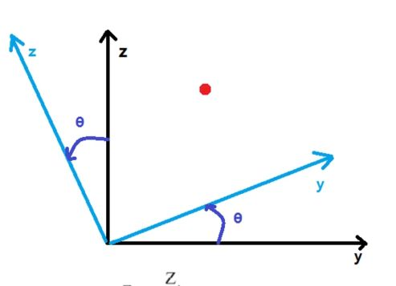
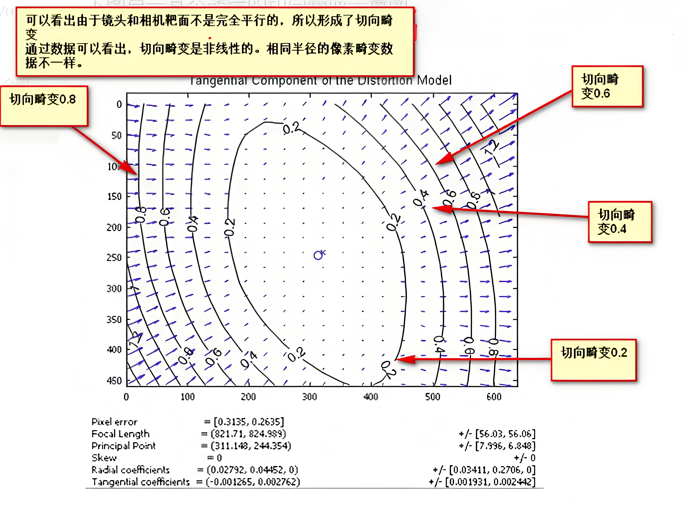
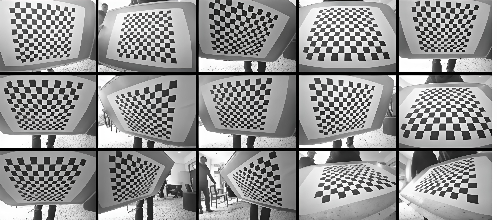
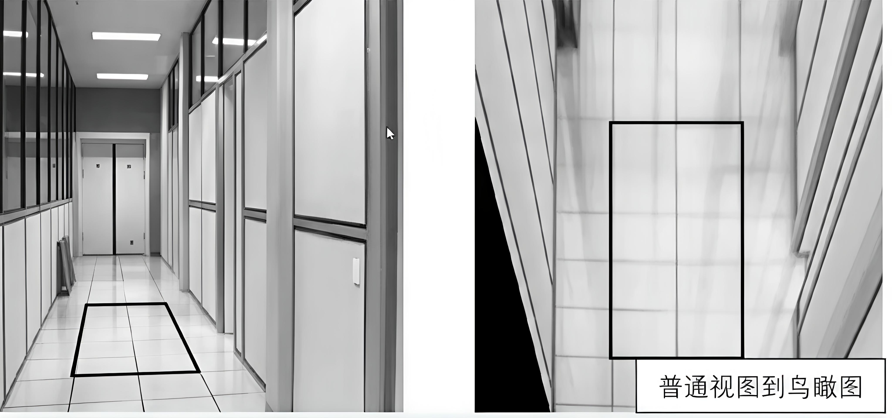
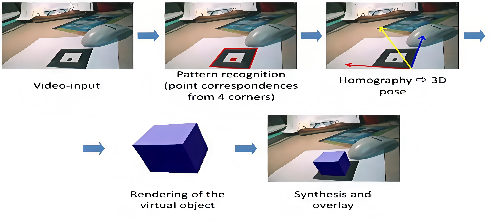
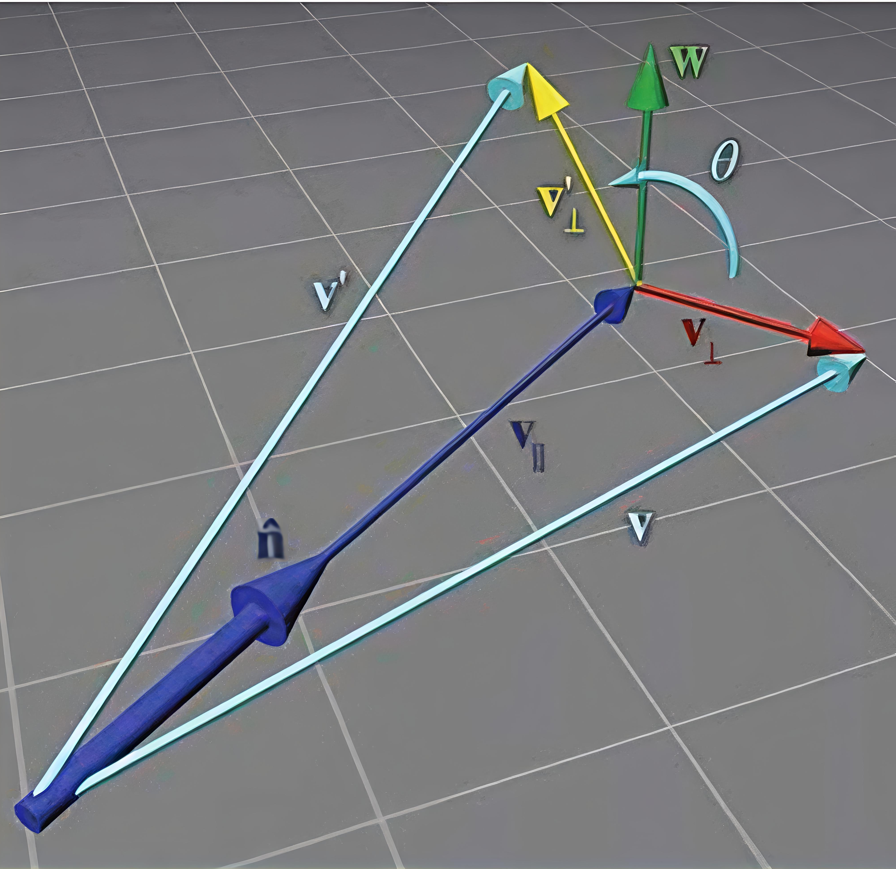
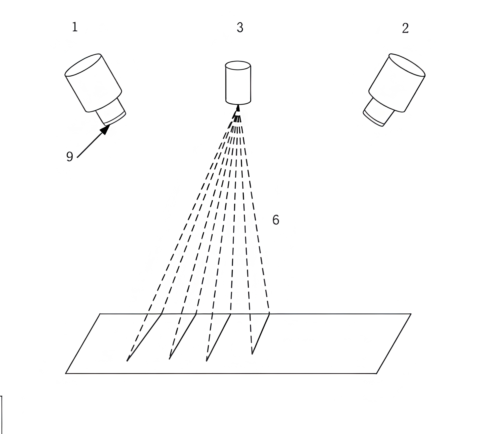

# 
张正友相机标定法

## 
YinKang'an

# 1.坐标系转换

## 相机标定是什么
- 空间物体表面某点的三维几何位置与其在图像中对应点的二维图像坐标之间的关系,必须建立相互关系,必须建立相机成像的几何模型
- 这些几何模型参数称相机的参数
- 求解相机参数的过程称为相机标定
## 世界坐标系与相机坐标系
- **世界坐标系**
  - 由于摄像机与被摄像可以放置在环境中的任意位置,这样就需要在环境中建立一个参考坐标系,来表示摄像机和被摄像物体的位置,这个坐标系称为世界坐标系
- **相机坐标系**
  - 也是一个三维直角坐标系,原点位于镜头光心,x轴指向相机向右,y轴指向相机向上,z轴指向相机前方
## 世界坐标系到相机坐标系的转换
**1. 旋转**
  - 旋转的表示有很多:
    - 旋转矩阵
    - 欧拉角
    - 四元数
    - 轴角
    - 李群与李代数
- 先旋转对齐,再平移回去

$$\begin{aligned}
& X_c=X \\
& Y c=\cos \theta \cdot Y+\sin \theta \cdot Z \\
& Z c=-\sin \theta \cdot Y+\cos \theta \cdot Z
\end{aligned}$$

$$\left[\begin{array}{c}
X_c \\
Y_c \\
Z_c
\end{array}\right]=\left[\begin{array}{ccc}
1 & 0 & 0 \\
0 & \cos \theta & \sin \theta \\
0 & -\sin \theta & \cos \theta
\end{array}\right]\left[\begin{array}{c}
X \\
Y \\
Z
\end{array}\right]$$

验证方法:所有的分解都满足**欧式距离不变性**

$$a_1{ }^2+a_2{ }^2+\cdots+a_n{ }^2=b_1{ }^2+b_2{ }^2+\cdots+b_n{ }^2$$

绕坐标轴旋转矩阵

$$\boldsymbol{R}(X_A, \theta) = \begin{bmatrix}
1 & 0 & 0 \\
0 & \cos\theta & -\sin\theta \\
0 & \sin\theta & \cos\theta
\end{bmatrix}$$

$$\boldsymbol{R}(Y_A, \theta) = \begin{bmatrix}
\cos\theta & 0 & -\sin\theta \\
0 & 1 & 0 \\
\sin\theta & 0 & \cos\theta
\end{bmatrix}$$

$$\boldsymbol{R}(Z_A, \theta) = \begin{bmatrix}
\cos\theta & -\sin\theta & 0 \\
\sin\theta & \cos\theta & 0 \\
0 & 0 & 1
\end{bmatrix}$$

所以将上面的旋转矩阵**连续左乘**,就得到了从世界坐标系到相机坐标系的旋转矩阵

$$\begin{aligned}
& {\left[{ }^A \operatorname{RPY}_B(\phi, \theta, \psi)\right]=\boldsymbol{R}\left(Z_A, \varphi\right) \boldsymbol{R}\left(Y_A, \theta\right) \boldsymbol{R}\left(X_A, \psi\right)} \\
& =\left[\begin{array}{ccc}
c \varphi s \theta & c \varphi s \theta s \psi-s \varphi c \psi & c \varphi s \theta c \psi+s \varphi s \psi \\
c \varphi c \theta & s \varphi s \theta s \psi+c \varphi c \psi & s \varphi s \theta c \psi-c \varphi s \psi \\
-s \theta & c \theta s \psi & c \theta c \psi
\end{array}\right]
\end{aligned}$$

补充:
- 左乘还是右乘
  - 左乘——相对于固定坐标系进行变换
  固定坐标系=变换*需变换坐标系
  (x2, y2) = A * (x1, y1)

  - 右乘——相对于自身(活跃)坐标系进行变换
  固定坐标系=需变换坐标系*变换
  (x2, y2) = (x1, y1) * A

旋转的左乘与右乘:[点击进入链接][旋转的左乘与右乘]

[旋转的左乘与右乘]:https://zhuanlan.zhihu.com/p/128155013

**2. 旋转+平移**

向量形式
$$\begin{bmatrix}
X_c \\
Y_c \\
Z_c
\end{bmatrix}
=R
\begin{bmatrix}
X_w \\
Y_w \\
Z_w
\end{bmatrix}+T$$

$$\begin{bmatrix}
X_c \\
Y_c \\
Z_c
\end{bmatrix}=\begin{bmatrix}
r_{11} & r_{12} & r_{13} \\
r_{21} & r_{22} & r_{23} \\
r_{31} & r_{32} & r_{33}
\end{bmatrix}
\begin{bmatrix}
X_W \\
Y_W \\
Z_W
\end{bmatrix}+\begin{bmatrix}
t_x \\
t_y \\
t_z
\end{bmatrix}$$

R,t 为相机外参(Camera Extrinsics)

齐次坐标形式

$$\begin{bmatrix}
x_c \\
y_c \\
z_c \\
1
\end{bmatrix}=\begin{bmatrix}
\boldsymbol{R} & \boldsymbol{t} \\
\boldsymbol{0} & 1
\end{bmatrix}
\begin{bmatrix}
x_w \\
y_w \\
z_w \\
1\end{bmatrix}$$

- 为什么要把世界坐标系变到相机坐标系？因为我们相机坐标系可以将图像的世界点联系起来
- 什么是世界点？一般情况下我们是需要测量物体到机器人的距离和位置关系,因此世界坐标系一般定在基座不动机器人上,或者是机器人工作的场景中

## 像素坐标系与图像坐标系
- **像素坐标系**
  - 像素坐标系uov是二维直角坐标系,反映了相机CCD/CMOS传感器的像素排列情况
  - 原点o在相机CCD/CMOS传感器的左上角,水平方向为u轴,垂直方向为v轴
  - 像素坐标系中坐标轴单位为像素(pixel),即一个像素为一个单位
- **图像坐标系**
  - 像素坐标系不利于坐标变换,因此需要建立图像坐标系XOY
  - 其坐标轴的单位通常为毫米(mm),原点是相机光轴与相面的交点(称为主点),即图像的中心点
  - X轴,Y轴分别与u轴,v轴平行.故两个坐标系实际是平移关系,即可以通过平移就可得到
## 图像坐标系转换为像素坐标系

$$\begin{bmatrix}
u \\
v \\
1
\end{bmatrix}=\begin{bmatrix}
1/dX & 0 & u_0 \\
0 & 1/dY & v_0 \\
0 & 0 & 1
\end{bmatrix}
\begin{bmatrix}
X \\
Y \\
1
\end{bmatrix}
$$

其中 $dX$,$dY$ 分别为像素在$X$,$Y$轴方向上的物理尺寸,$u_0, v_0$ 为主点(图像原点)坐标
 
公式$ u = \frac{X}{dX} + u_0 $的含义:物理坐标$X$除以单个像素的物理尺寸$dX$得到像素数,再加上主点在像素坐标系中的水平偏移量 $u_0$,即可得到该点在像素坐标系下的水平坐标 $u$

## 针孔成像原理

空间任意一点 $P$ 与其图像点 $p'$ 之间的关系，$P$ 与相机光心 $O$ 的连线为 $OP$, $OP$ 与像面的交点 $p'$ 即为空间点 $P$ 在图像坐标系上的投影

该过程为透视投影,如下矩阵表示:

$$s
\begin{bmatrix}
X \\
Y \\
1
\end{bmatrix}=\begin{bmatrix}
f & 0 & 0 & 0 \\
0 & f & 0 & 0 \\
0 & 0 & 1 & 0
\end{bmatrix}
\begin{bmatrix}
x_c \\
y_c \\
z_c \\
1
\end{bmatrix}$$

公式中的比例因子 $s$ 等价于相机坐标系下的深度值 $z_c$,即 $s=Z_c$

$z_c$ 是3D空间点到相机光心的距离,它是针孔成像相似三角形比例关系的核心依据,并非成像平面的坐标值,因此被整合为比例因子,用来完成3D坐标到2D像素坐标的齐次变换

$f$ 为有效焦距(光心到图像坐标系的距离),$(x_c,y_c,z_c,1)^T$ 是空间点 $P$ 在相机坐标系 $O-x_c-y_c-z_c$ 中的齐次坐标，$(X,Y,1)^T$ 是像点 $p'$ 在图像物理坐标系 $O'-X-Y$ 中的齐次坐标

## 世界坐标系转换为像素坐标系
- **世界坐标系到相机坐标系**

$$\begin{bmatrix}
x_c \\
y_c \\
z_c \\
1
\end{bmatrix}=\begin{bmatrix}
\boldsymbol{R} & \boldsymbol{t} \\
\boldsymbol{0} & 1
\end{bmatrix}
\begin{bmatrix}
x_w \\
y_w \\
z_w \\
1\end{bmatrix}$$

- **相机坐标系到图像坐标系**

$$
s
\begin{bmatrix}
X \\
Y \\
1
\end{bmatrix}=\begin{bmatrix}
f & 0 & 0 & 0 \\
0 & f & 0 & 0 \\
0 & 0 & 1 & 0
\end{bmatrix}
\begin{bmatrix}
x_c \\
y_c \\
z_c \\
1
\end{bmatrix}
$$

- **图像坐标系到像素坐标系**

$$\begin{bmatrix}
u \\
v \\
1
\end{bmatrix}=\begin{bmatrix}
1/dX & 0 & u_0 \\
0 & 1/dY & v_0 \\
0 & 0 & 1
\end{bmatrix}
\begin{bmatrix}
X \\
Y \\
1
\end{bmatrix}
$$

- **世界坐标系到像素坐标系**

$$\therefore
s\begin{bmatrix}u \\ v \\ 1\end{bmatrix}=
\begin{bmatrix}
1/dX & 0 & u_0 \\
0 & 1/dY & v_0 \\
0 & 0 & 1
\end{bmatrix}
\begin{bmatrix}
f & 0 & 0 & 0 \\
0 & f & 0 & 0 \\
0 & 0 & 1 & 0
\end{bmatrix}
\begin{bmatrix}
\mathbf{R} & \mathbf{t} \\
\mathbf{0} & 1
\end{bmatrix}
\begin{bmatrix}
x_w \\
y_w \\
z_w \\
1
\end{bmatrix}
$$

$$
=\begin{bmatrix}
\alpha_x & 0 & u_0 & 0 \\
0 & \alpha_y & v_0 & 0 \\
0 & 0 & 1 & 0
\end{bmatrix}
\begin{bmatrix}
\mathbf{R} & \mathbf{t} \\
\mathbf{0} & 1
\end{bmatrix}
\begin{bmatrix}
x_w \\
y_w \\
z_w \\
1
\end{bmatrix}
= \mathbf{M}_1\mathbf{M}_2\mathbf{X}_w = \mathbf{M}\mathbf{X}_w
$$

其中 $\alpha_x = f/dX$,$\alpha_y = f/dY$,称为 $u$ , $v$ 轴的尺度因子,$\mathbf{M}_1$ 称为相机的内部参数矩阵,$\mathbf{M}_2$ 称为相机的外部参数矩阵, $\mathbf{M}$ 称为投影矩阵

# 2.畸变
## 畸变参数(distortion parameter)
 
- 在几何光学和阴极射线管(CRT)显示中，畸变(distortion)是对直线投影(rectilinear projection)的一种偏移
- 简单来说直线投影是场景内的一条直线投影到图片上也保持为一条直线
- 那畸变简单来说就是一条直线投影到图片上不能保持为一条直线了，这是一种光学畸变(optical aberration)
- 畸变一般可以分为两大类,包括径向畸变和切向畸变.主要的一般径向畸变有时也会有轻微的切向畸变
  
- 畸变一般可以分为:径向畸变、切向畸变
- 径向畸变来自于透镜形状
- 切向畸变来自于整个摄像机的组装过程
- 畸变还有其他类型的畸变,但是没有径向畸变,切向畸变显著

径向畸变（Radial distortion）

- 实际摄像机的透镜总是在成像仪的边缘产生显著的畸变,这种现象来源于"筒形"或"鱼眼"的影响.
- 光线在远离透镜中心的地方比靠近中心的地方更加弯曲.对于常用的普通透镜来说,这种现象更加严重.

对于径向畸变，成像仪中心（光学中心）的畸变为0，随着向边缘移动，畸变越来越严重 
 

径向畸变有三种：
- 桶形畸变(barrel distortion)
- 枕形畸变(pincushion distortion)
- 胡子畸变(mustache distortion)

切向畸变

- 切向畸变是由于透镜制造上的缺陷使得透镜本身与图像平面不平行而产生的
- 切向畸变可分为:薄透镜畸变、离心畸变

切向畸变图示：

当透镜不完全平行于图像平面时候产生切向畸变

## 畸变矫正

这些公式的作用,就是把变形的像素坐标(`x_dis`, `y_dis`)计算为无变形的正确坐标(`x_corr`, `y_corr`)
- **径向畸变矫正公式**：

  $$
  x_{corr} = x_{dis}(1 + k_1 r^2 + k_2 r^4 + k_3 r^6)
  $$
  $$
  y_{corr} = y_{dis}(1 + k_1 r^2 + k_2 r^4 + k_3 r^6)
  $$

  - **核心思路**:径向畸变的程度与像素点到图像中心的距离成正比,距离越远,变形越严重.
    - $r$ 代表畸变点到图像中心的距离（$r^2 = x_{dis}^2 + y_{dis}^2$）。
    - $k_1, k_2, k_3$ 是**径向畸变系数**,由相机标定得到:
    - $k_1$ 为正 → 桶形畸变；为负 → 枕形畸变
    - $k_2, k_3$ 用于修正更复杂的高阶畸变
  - **公式逻辑**:给畸变点的坐标,乘以一个和距离相关的修正因子,把它“拉回”到正确位置

- **切向畸变矫正公式**:

  - **核心思路**:切向畸变是因为镜头和传感器不平行,导致像素在垂直于径向的方向上发生偏移
  - $p_1,p_2$ 是**切向畸变系数**,同样由相机标定得到
  - **公式逻辑**：在原畸变坐标上,叠加一个切向偏移量,这个偏移量与像素位置($x,y$)和到中心的距离($r$)都有关

  $$
  x_{corr} = x_{dis} + \left[2p_1 xy + p_2(r^2 + 2x^2)\right]
  $$
  $$
  y_{corr} = y_{dis} + \left[p_1(r^2 + 2y^2) + 2p_2 xy\right]
  $$

  其中：
  - $x_{dis}$ 和 $y_{dis}$ 表示有畸变的坐标；
  - $x_{corr}$ 和 $y_{corr}$ 表示修复后的坐标；
  - $k_1, k_2, k_3$ 表示径向畸变参数；
  - $p_1, p_2$ 表示切向畸变参数；

所以最终得到5个畸变参数：

$$D = (k_1,\ \ k_2,\ \ p_1,\ \ p_2,\ \ k_3)$$

# 3.张学友相机标定法
## 标定方法分类
- **传统的摄像机标定方法**
  - 在一定摄像机模型下, 基于特定的实验条件如形状、尺寸已知参照物, 进行图像处理, 数学变换、技术方法, 求取内外参数
  - 经常调整摄像机的需求、设置已知参照物不现实
  - 包括利用最优化算法的标定方法, 利用摄像机变换矩阵的标定方法、进一步考虑畸变补偿的两步法、张正友标定法

- **自标定法**
  - 不依赖参照物
  - 利用摄像机本身参数之间的约束关系来标定
  - 利用周围图像与图像之间的对应关系
  - 与场景和摄像机运动无关
  - 基于Krupa方程、分层逐步标定法、基于二次曲面自标定

## 张正友博士
世界著名的计算机视觉和多媒体技术的专家, ACM Fellow, IEEE Fellow. 微软研究院视觉技术组高级研究员.他在立体视觉、三维重建、运动分析、图像配准、摄像机标定等方面都有开创性的贡献

「张氏标定法」是张正友博士在1999年发表在国际顶级会议ICCV上的论文《Flexible Camera Calibration By Viewing a Plane From Unknown Orientations》中, 提出的一种利用平面棋盘格进行相机标定的实用方法。该方法介于摄影标定法和自标定法之间, 既克服了摄影标定法需要的高精度三维标定物的缺点, 又解决了自标定法鲁棒性差的难题. **标定过程仅需使用一个打印出来的棋盘格, 并从不同方向拍摄几组图片即可, 任何人都可以自己制作标定图案, 不仅实用灵活方便, 而且精度很高, 鲁棒性好.** 因此很快被全世界广泛采用, 极大的促进了三维计算机视觉从实验室走向真实世界的进程。

## 棋盘
棋盘是一块由黑白方块间隔组成的标定板, 我们用它来作为相机标定的**标定物**(从真实世界映射到数字图像内的对象).之所以我们用棋盘作为标定物是因为平面棋盘模式更容易处理(相对于复杂的三维物体),但与此同时,二维物体相对于三维物体会缺少一部分信息, 于是我们会多次改变棋盘的方位来捕捉图像, 以求获得更丰富的坐标信息.

如下图所示, 是相机在不同方向下拍摄的同一个棋盘图像。

## 世界坐标系到像素坐标系公式

$$
s\begin{bmatrix}u \\ v \\ 1\end{bmatrix}=
\begin{bmatrix}
1/dX & 0 & u_0 \\
0 & 1/dY & v_0 \\
0 & 0 & 1
\end{bmatrix}
\begin{bmatrix}
f & 0 & 0 & 0 \\
0 & f & 0 & 0 \\
0 & 0 & 1 & 0
\end{bmatrix}
\begin{bmatrix}
\mathbf{R} & \mathbf{t} \\
\mathbf{0} & 1
\end{bmatrix}
\begin{bmatrix}
x_w \\
y_w \\
z_w \\
1
\end{bmatrix}
$$

$$
=\begin{bmatrix}
\alpha_x & 0 & u_0 & 0 \\
0 & \alpha_y & v_0 & 0 \\
0 & 0 & 1 & 0
\end{bmatrix}
\begin{bmatrix}
\mathbf{R} & \mathbf{t} \\
\mathbf{0} & 1
\end{bmatrix}
\begin{bmatrix}
x_w \\
y_w \\
z_w \\
1
\end{bmatrix}
= \mathbf{M}_1\mathbf{M}_2\mathbf{X}_w = \mathbf{M}\mathbf{X}_w
$$

**棋盘是一个二维平面,在标定时,会人为地把它放在世界坐标系的 XY 平面上,这样,棋盘上所有角点的世界坐标 Z 值就都是`0`,也就是 $z_w = 0$**

**这个设定能把复杂的三维坐标问题简化成二维平面问题，让计算变得更简单**

$$
\begin{bmatrix}
u \\
v \\
1
\end{bmatrix}
= s
\begin{bmatrix}
f_x & \gamma & u_0 \\
0 & f_y & v_0 \\
0 & 0 & 1
\end{bmatrix}
\begin{bmatrix}
r_1 & r_2 & t
\end{bmatrix}
\begin{bmatrix}
x_w \\
y_w \\
1
\end{bmatrix}
$$

# 4.单应性

## 单应性(Homography)变换
- 来描述物体在世界坐标系和像素坐标系之间的位置映射关系。对应的变换矩阵称为单应性矩阵。在上述式子中, 单应性矩阵 $\text{H}$ 定义为:

$$
H = s\begin{bmatrix}
f_x & \gamma & u_0 \\
0 & f_y & v_0 \\
0 & 0 & 1
\end{bmatrix}
\begin{bmatrix}
r_1 & r_2 & t
\end{bmatrix}
= sM_1\begin{bmatrix}
r_1 & r_2 & t
\end{bmatrix}
$$

1. **$s$**:尺度因子,本质是相机坐标系下深度值 $z_c$ 的倒数,用于齐次坐标的比例归一化
2. **$\gamma$**：像素倾斜系数,常规相机像素正交排列时该值为 0,仅特殊相机需用其修正像素排列偏差
3. **$u_0、v_0$**:主点像素坐标,理论上是 CMOS 传感器的几何中心,实际因镜头与传感器安装偏差,需通过标定获取真实值
4.  $\begin{bmatrix}\mathbf{r_1}&\mathbf{r_2}&\mathbf{t}\end{bmatrix}$ 是外参矩阵的简化形式，\,因单应性变换基于 $z_w=0$ 的平面,无需旋转矩阵的第三列

## 单应性在计算机视觉中的应用
单应性在图像校正、图像拼接、相机位姿估计、视觉SLAM等领域有非常重要的作用

- 图像矫正
需要4对对应的点才能行,具体原因在后面会提到.

- 视角变换
从一个普通的视角变成鸟瞰图,到第二个是视角的变换

- 图像拼接
  既然单应矩阵可以进行视角转换, 那我们把不同角度拍摄的图像都转换到同样的视角下, 就可以实现图像拼接了。如下图所示, 通过单应矩阵H可以将image1和image2都变换到同一个平面。

- 增强现实(AR)
平面二维标记图案(marker)经常用来做AR展示。根据marker不同视角下的图像可以方便的得到虚拟物体的位置姿态并进行显示

## **如何`估计`单应性矩阵H**
- 首先, 我们假设**世界上某平面的点与它在图像上的投影像素坐标点**齐次坐标分别为世界坐标 $(x,y,1)$ 和像素坐标 $(x',y',1)$
单应矩阵 $H$ 定义为:

$$
H = \begin{bmatrix}
h_{11} & h_{12} & h_{13} \\
h_{21} & h_{22} & h_{23} \\
h_{31} & h_{32} & h_{33}
\end{bmatrix}
$$

则

$$
\begin{bmatrix}
x' \\
y' \\
1
\end{bmatrix}
\sim
\begin{bmatrix}
h_{11} & h_{12} & h_{13} \\
h_{21} & h_{22} & h_{23} \\
h_{31} & h_{32} & h_{33}
\end{bmatrix}
\begin{bmatrix}
x \\
y \\
1
\end{bmatrix}
$$

$$
x' = \frac{h_{11}x + h_{12}y + h_{13}}{h_{31}x + h_{32}y + h_{33}}
$$

$$
y' = \frac{h_{21}x + h_{22}y + h_{23}}{h_{31}x + h_{32}y + h_{33}}
$$

**思考:单应矩阵 $H$ 有几个自由度?**

- ~~9个啊，H矩阵不是9个参数吗?~~

**补充：齐次坐标系基础**
  1. **定义**
      齐次坐标系是用 **n+1 维坐标表示 n 维空间点**的数学工具。
      - 2D 平面点的普通坐标 $(x,y)$，对应齐次坐标为 $(x,y,1)$，最后一个分量称为**尺度分量**。
      - 3D 空间点的普通坐标 $(x,y,z)$，对应齐次坐标为 $(x,y,z,1)$。

  2. **核心特性：缩放不变性**
      若给齐次坐标 $(x,y,w)$ 乘以任意非零常数 $k$，得到 $(kx,ky,kw)$，两个齐次坐标**对应同一个普通 2D 点**。
      - 转换规则：齐次坐标转普通坐标 = 前 n 个分量 ÷ 最后一个尺度分量
      - 示例：齐次坐标 $(2,4,2)$ 和 $(1,2,1)$，转换后均为普通坐标 $(1,2)$

  3. **关键辨析：尺度分量的双重作用**
     - **尺度属性**：这是它被称为“尺度分量”的核心原因，通过前 n 个分量除以它，能完成齐次坐标到普通坐标的归一化，也是单应矩阵只需要 8 个独立参数的根源
     - **平移属性**：在坐标变换（如仿射变换）中，齐次坐标的矩阵运算形式可以把平移量整合到变换矩阵里，此时最后一个分量作为“载体”让平移和旋转、缩放可以用同一个矩阵计算，比如 2D 平移 

$$\begin{bmatrix}x+t_x\\y+t_y\\1\end{bmatrix}=\begin{bmatrix}1&0&t_x\\0&1&t_y\\0&0&1\end{bmatrix}\begin{bmatrix}x\\y\\1\end{bmatrix}$$

所以这里使用的是齐次坐标系，也就是说可以进行任意尺度的缩放

比如我们把$h_{ij}$乘以任意一个非零常数$k$并不改变等式结果：

$$x' = \frac{k h_{11}x + k h_{12}y + k h_{13}}{k h_{31}x + k h_{32}y + k h_{33}}
\quad \Rightarrow \quad
x' = \frac{h_{11}x + h_{12}y + h_{13}}{h_{31}x + h_{32}y + h_{33}}$$

$$y' = \frac{k h_{21}x + k h_{22}y + k h_{23}}{k h_{31}x + k h_{32}y + k h_{33}}
\quad \Rightarrow \quad
y' = \frac{h_{21}x + h_{22}y + h_{23}}{h_{31}x + h_{32}y + h_{33}}$$

$$h(\mathbf{x}) = (\alpha\mathbf{H})\mathbf{x} = \mathbf{H}(\alpha\mathbf{x}) = \mathbf{H}\mathbf{x}$$

在齐次坐标下,单应矩阵整体缩放和对应点坐标缩放的效果完全等价,所以矩阵的整体缩放不改变最终变换结果
**单应矩阵 $H$ 有8个自由度!!**

**两种归一化形式**
1. **固定$h_{33}=1$**
直接把九个参数中的一个固定住，那么剩下的正好是八个自由度

$$x' = \frac{h_{11}x + h_{12}y + h_{13}}{h_{31}x + h_{32}y + \boldsymbol{1}}$$
$$y' = \frac{h_{21}x + h_{22}y + h_{23}}{h_{31}x + h_{32}y + \boldsymbol{1}}$$

2. **模长归一化**
有八个自由度，但是有九个参数，那么少一个约束条件，约束条件就把模长定为`1`

$$x' = \frac{h_{11}x + h_{12}y + h_{13}}{h_{31}x + h_{32}y + h_{33}}$$
$$y' = \frac{h_{21}x + h_{22}y + h_{23}}{h_{31}x + h_{32}y + h_{33}}$$
$$h_{11}^2 + h_{12}^2 + h_{13}^2 + h_{21}^2 + h_{22}^2 + h_{23}^2 + h_{31}^2 + h_{32}^2 + h_{33}^2 = 1$$

**8自由度下H计算**

**1.方程变形**

$$(h_{31}x + h_{32}y + h_{33})x' = h_{11}x + h_{12}y + h_{13}$$$$
(h_{31}x + h_{32}y + h_{33})y' = h_{21}x + h_{22}y + h_{23}$$

 

$$h_{11}x + h_{12}y + h_{13} - h_{31}xx' - h_{32}yx' - h_{33}x' = 0$$$$h_{21}x + h_{22}y + h_{23} - h_{31}xy' - h_{32}yy' - h_{33}y' = 0$$

**2.特征点匹配对**
先把方程变形写成矩阵
再假如我们得到了两幅图片中对应的N个点对（特征点匹配对），那么可以得到如下`齐次线性方程组`：

**矩阵形式（2N × 9） × （9 × 1） = （2N × 1）**

**4 points:** 

$$
\underbrace{\begin{bmatrix}
x_1 & y_1 & 1 & 0 & 0 & 0 & -x_1x'_1 & -y_1x'_1 & -x'_1 \\
0 & 0 & 0 & x_1 & y_1 & 1 & -x_1y'_1 & -y_1y'_1 & -y'_1 \\
\vdots & \vdots & \vdots & \vdots & \vdots & \vdots & \vdots & \vdots & \vdots
\end{bmatrix}}_{2N \times 9}
\underbrace{\begin{bmatrix}
h_{11} \\
h_{12} \\
h_{13} \\
h_{21} \\
h_{22} \\
h_{23} \\
h_{31} \\
h_{32} \\
h_{33}
\end{bmatrix}}_{9 \times 1}=\underbrace{\begin{bmatrix}
0 \\
0 \\
\vdots
\end{bmatrix}}_{2N \times 1}
$$

**additional points:**

$$
h_{11}x + h_{12}y + h_{13} - h_{31}xx' - h_{32}yx' - h_{33}x' = 0
$$
$$
h_{21}x + h_{22}y + h_{23} - h_{31}xy' - h_{32}yy' - h_{33}y' = 0
$$

 
- 由于单应矩阵 H 包含了 ||H||=1 约束,因此根据上图的线性方程组,8自由度的 $H$ 至少需要4对对应的点(每个点的x坐标y坐标分别为两个条件)才能计算出单应矩阵.
这也回答了前面图像校正中为何至少需要4个点对的根本原因.
 
- 但是,以上只是理论推导,在真实的应用场景中,我们计算的点对中都会包含噪声.比如点的位置偏差几个像素,甚至出现特征点对误匹配的现象,如果只使用4个点对来计算单应矩阵,那会出现很大的误差.因此为了使得计算更精确,一般都会使用远大于4个点对来计算单应矩阵.另外上述方程组采用直接线性解法通常很难得到最优解,所以实际使用中一般会用其他优化方法如奇异值分解,Levenberg-Marquararat(LM)算法等进行求解.
 
- 1.打印一张棋盘格标定图纸,将其贴在平面物体的表面
- 2.拍摄一组不同方向棋盘格的图片,可以通过移动相机来实现,也可以移动标定图片来实现.
- 3.对于每张拍摄的棋盘图片,检测图片中所有棋盘格的特征点 (角点，也就是下图中黑白棋盘交叉点,中间品红色的圆圈内就是一个角点).我们定义打印的棋盘图纸位于世界坐标系 $z_w=0$ 的平面上,世界坐标系的原点位于棋盘图纸的固定一角(比如下图中黄色点)像素坐标系原点位于图片左上角.

- 因为棋盘标定图纸中所有角点的空间坐标是已知的，这些角点对应在拍摄的标定图片中的角点的像素坐标也是已知的，如果我们得到这样的 $N>=4$ 个匹配点对（越多计算结果越鲁棒），就可以根据LM等优化方法得到其单应矩阵 $H$.
当然计算单应矩阵一般不需要自己写函数实现,OpenCV中就有现成的函数可以调用

# 5.张学友相机标定数学推导

1.通过上文相机成像几何模型，知道了如何将世界坐标系中的三维坐标和像素坐标系中的二维坐标联系起来
2.通过上文,根据标定棋盘图纸及其对应的照片已经可以得到单应矩阵 $\rm H$ 了.如下所示：

$$
\rm H = s\begin{bmatrix}
f_x & \gamma & u_0 \\
0 & f_y & v_0 \\
0 & 0 & 1
\end{bmatrix}
\begin{bmatrix}
r_1 & r_2 & t
\end{bmatrix}
= sM_1\begin{bmatrix}
r_1 & r_2 & t
\end{bmatrix}
$$

如何通过 $H$ 来求解相机的内参 $M_1$ 矩阵，以及外参$\begin{bmatrix}
r_1 & r_2 & t
\end{bmatrix}$矩阵？

先把内参求出来,(因为内参比较好求)求完内参后,外参也就能解出来了

## 不考虑镜头畸变
- 求解思路是利用**旋转向量**的约束关系
  - 先将单应性矩阵H化为3个列向量 $H=[h_1\ h_2\ h_3]$

$$H = \begin{bmatrix} \mathbf{h}_1 & \mathbf{h}_2 & \mathbf{h}_3 \end{bmatrix} = sM\begin{bmatrix} \mathbf{r}_1 & \mathbf{r}_2 & \mathbf{t} \end{bmatrix}$$

$$h_1 = sM r_1 \quad \text{或} \quad r_1 = \lambda M^{-1} h_1
$$$$h_2 = sM r_2 \quad \text{或} \quad r_2 = \lambda M^{-1} h_2$$$$h_3 = sM t \quad \text{或} \quad t = \lambda M^{-1} h_3$$

其中 $$\lambda = s^{-1}$$

**利用旋转向量的原理:**
**旋转向量在构造中是相互正交的**

\(r_1\) 和 \(r_2\) 相互正交，由此我们就可以利用“正交”的两个含义，得出每个单应矩阵提供的两个约束条件：

1. 旋转向量点积为0（两垂直平面上的旋转向量互相垂直）
即：

$$r_1^T r_2 = 0$$
代入 \(r_1 = \lambda M^{-1} h_1\) 和 \(r_2 = \lambda M^{-1} h_2\)，可得：
$$h_1^T \left(M^{-1}\right)^T M^{-1} h_2 = 0$$

2. 旋转向量长度相等（旋转不改变尺度）
即：

$$\|r_1\| = \|r_2\| = 1 \implies r_1^T r_1 = r_2^T r_2$$
代入 \(r_1 = \lambda M^{-1} h_1\) 和 \(r_2 = \lambda M^{-1} h_2\)，可得：
$$h_1^T \left(M^{-1}\right)^T M^{-1} h_1 = h_2^T \left(M^{-1}\right)^T M^{-1} h_2$$

**一个单应性矩阵H可以提供上述两个约束条件**

- 那么如何利用上述两个约束条件求解内参或者外参呢？一步一步来看，由前面可知内参矩阵 \(M\)：

$$M = \begin{bmatrix}
f_x & \gamma & u_0 \\
0 & f_y & v_0 \\
0 & 0 & 1
\end{bmatrix}$$

定义矩阵 \(B = (M^{-1})^T M^{-1}\),[仅仅是上面计算反复用到],展开后为：

$$B = \left(M^{-1}\right)^T M^{-1}=\begin{bmatrix}
\frac{1}{f_x^2} & -\frac{\gamma}{f_x^2 f_y} & \frac{v_0 \gamma - u_0 f_y}{f_x^2 f_y} \\
-\frac{\gamma}{f_x^2 f_y} & \frac{\gamma^2}{f_x^2 f_y^2} + \frac{1}{f_y^2} & -\frac{\gamma (v_0 \gamma - u_0 f_y)}{f_x^2 f_y^2} - \frac{v_0}{f_y^2} \\
\frac{v_0 \gamma - u_0 f_y}{f_x^2 f_y} & -\frac{\gamma (v_0 \gamma - u_0 f_y)}{f_x^2 f_y^2} - \frac{v_0}{f_y^2} & \frac{(v_0 \gamma - u_0 f_y)^2}{f_x^2 f_y^2} + \frac{v_0^2}{f_y^2} + 1
\end{bmatrix}
= \begin{bmatrix}
B_{11} & B_{12} & B_{13} \\
B_{21} & B_{22} & B_{23} \\
B_{31} & B_{32} & B_{33}
\end{bmatrix}$$

显然, $B = \left(M^{-1}\right)^T M^{-1}$ 是一个对称矩阵,
那么其实这些 $B_{ij}$ 只需要求六个即可,而不是九个(对角线之上的求出来即可)

**B带入前面两个约束条件后可转化为**

$$
\begin{cases}
\mathbf{h}_1^T B \mathbf{h}_2 = 0 \\
\mathbf{h}_1^T B \mathbf{h}_1 = \mathbf{h}_2^T B \mathbf{h}_2
\end{cases}
$$

定义3×3的单应矩阵 \(H=[\mathbf{h}_1\ \mathbf{h}_2\ \mathbf{h}_3]\) 的第 \(i\) 列列向量:

$$
\mathbf{h}_i = \left[h_{i1}, h_{i2}, h_{i3}\right]^T
$$

为了简化表达形式,令:

$$
\mathbf{h}_i^T B \mathbf{h}_j =
\begin{bmatrix}
h_{i1}h_{j1} \\
h_{i1}h_{j2} + h_{i2}h_{j1} \\
h_{i2}h_{j2} \\
h_{i3}h_{j1} + h_{i1}h_{j3} \\
h_{i3}h_{j2} + h_{i2}h_{j3} \\
h_{i3}h_{j3}
\end{bmatrix}^T
\begin{bmatrix}
B_{11} \\
B_{12} \\
B_{22} \\
B_{13} \\
B_{23} \\
B_{33}
\end{bmatrix}
$$

$$
v_{ij} =
\begin{bmatrix}
h_{i1}h_{j1} \\
h_{i1}h_{j2} + h_{i2}h_{j1} \\
h_{i2}h_{j2} \\
h_{i3}h_{j1} + h_{i1}h_{j3} \\
h_{i3}h_{j2} + h_{i2}h_{j3} \\
h_{i3}h_{j3}
\end{bmatrix},
\quad
b =\begin{bmatrix}
B_{11} \\
B_{12} \\
B_{22} \\
B_{13} \\
B_{23} \\
B_{33}
\end{bmatrix}
$$

**两约束条件最终可以转化为如下形式:**

$$\begin{cases}
\mathbf{h}_1^T B \mathbf{h}_2 = 0 \\
\mathbf{h}_1^T B \mathbf{h}_1 = \mathbf{h}_2^T B \mathbf{h}_2
\end{cases}$$

$$\begin{cases}
v_{12}^T b = 0 \\
\left(v_{11}^T - v_{22}^T\right) b = 0
\end{cases}
\implies
\begin{bmatrix}
v_{12}^T \\
v_{11}^T - v_{22}^T
\end{bmatrix} b = 0$$

如果我们拍摄了 $n$ 张不同角度的标定图片,因为每张图片我们都可以得到一组(2个,1个 $x$ ,1个 $y$ )上述的等式.其中, $v12,v11,v22$ 可以通过前面已经计算好的单应矩阵得到,因此是已知的,而b中6个元素是待求的未知数.因此,至少需要保证图片数 \(n \ge 3\) ,我们才能解出 $b$

## 1.求相机内参数
- 前面说到，B中包含一个尺度因子$\lambda$，即

$$
B = \lambda M^{-T} M
$$

- 假设我们已经根据前面计算得到了矩阵B元素的值，那么根据已知的矩阵B很容易解出内参，如下：

$$B = \left(M^{-1}\right)^T M^{-1}=\begin{bmatrix}
\frac{1}{f_x^2} & -\frac{\gamma}{f_x^2 f_y} & \frac{v_0 \gamma - u_0 f_y}{f_x^2 f_y} \\
-\frac{\gamma}{f_x^2 f_y} & \frac{\gamma^2}{f_x^2 f_y^2} + \frac{1}{f_y^2} & -\frac{\gamma (v_0 \gamma - u_0 f_y)}{f_x^2 f_y^2} - \frac{v_0}{f_y^2} \\
\frac{v_0 \gamma - u_0 f_y}{f_x^2 f_y} & -\frac{\gamma (v_0 \gamma - u_0 f_y)}{f_x^2 f_y^2} - \frac{v_0}{f_y^2} & \frac{(v_0 \gamma - u_0 f_y)^2}{f_x^2 f_y^2} + \frac{v_0^2}{f_y^2} + 1
\end{bmatrix}
= \begin{bmatrix}
B_{11} & B_{12} & B_{13} \\
B_{21} & B_{22} & B_{23} \\
B_{31} & B_{32} & B_{33}
\end{bmatrix}$$

$$
\begin{cases}
f_x = \sqrt{\lambda / B_{11}} \\
f_y = \sqrt{\lambda B_{11} / (B_{11} B_{22} - B_{12}^2)} \\
u_0 = \gamma v_0 / f_y - B_{13} f_x^2 / \lambda \\
v_0 = (B_{12} B_{13} - B_{11} B_{23}) / (B_{11} B_{22} - B_{12}^2) \\
\gamma = -B_{12} f_x^2 f_y / \lambda \\
\lambda = B_{33} - [B_{13}^2 + v_0 (B_{12} B_{13} - B_{11} B_{23})] / B_{11}
\end{cases}
$$

## 2.求相机外参
- 得到内参数后，内参矩阵M也已知。单应矩阵H也已知，因此可继续求得外参数：

$$
H = [\boldsymbol{h}_1\ \boldsymbol{h}_2\ \boldsymbol{h}_3] = sM[\boldsymbol{r}_1\ \boldsymbol{r}_2\ \boldsymbol{t}]
$$
$$
M = \begin{bmatrix}
f_x & \gamma & u_0 \\
0 & f_y & v_0 \\
0 & 0 & 1
\end{bmatrix}
$$
$$
\boldsymbol{r}_1 = \lambda M^{-1} \boldsymbol{h}_1,\quad
\boldsymbol{r}_2 = \lambda M^{-1} \boldsymbol{h}_2,\quad
\boldsymbol{r}_3 = \boldsymbol{r}_1 \times \boldsymbol{r}_2,\quad
\boldsymbol{t} = \lambda M^{-1} \boldsymbol{h}_3
$$

- 其中又由旋转矩阵性质有

$$
\|\boldsymbol{r}_1\| = \|\lambda M^{-1} \boldsymbol{h}_1\| = 1
$$
$$
\lambda = 1 / \|M^{-1} \boldsymbol{h}_1\|
$$

## 3.奇异值分解
- 上述的推导结果是基于理想情况下的解，从理论上证明了张氏标定算法的可行性
- 在实际标定过程中，一般使用最大似然估计进行优化。假设我们拍摄了n张标定图片，每张图片里有m个棋盘格角点。三维空间点X在图片上对应的二维像素为x，三维空间点经过相机内参M，外参R, t变换后得到的二维像素为x'，假设噪声是独立同分布的，我们通过最小化x, x'的位置来求解上述最大似然估计问题：

$$
\sum_{i=1}^n \sum_{j=1}^m \|x_{ij} - x'(M, R_i, t_i, X_j)\|^2
$$

## 考虑透镜畸变
- 由于径向畸变的影响相对较明显，所以主要考虑径向畸变参数，根据经验，通常只考虑径向畸变的前两个参数k1,k2就可以(增加更多的参数会使得模型变的复杂且不稳定).实际求解中，通常把k1,k2也作为参数加入上述函数一起进行优化，待优化函数如下所示：

$$
\sum_{i=1}^n \sum_{j=1}^m \|x_{ij} - x'(M, k_1, k_2, R_i, t_i, X_j)\|^2
$$

- 上述非线性优化问题通常用Levenberg-Marquardt（LM）算法进行迭代求解.一般将k1,k2初值设为0.