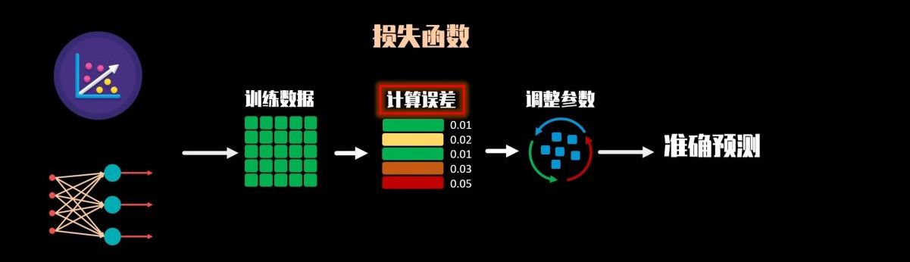
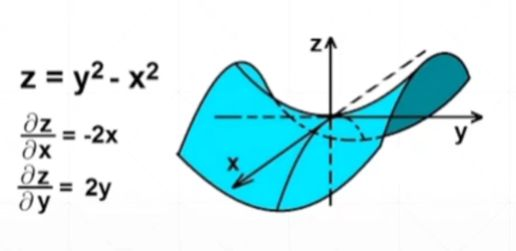
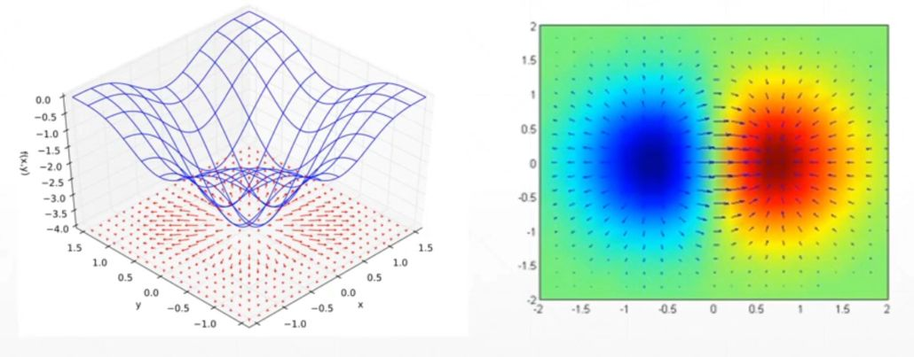
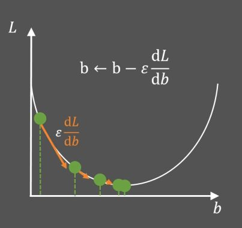
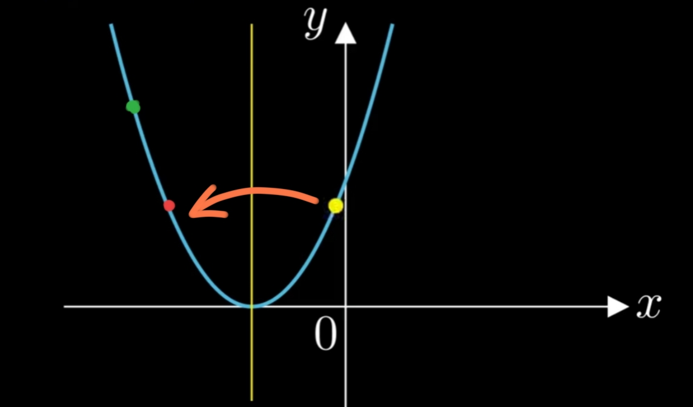
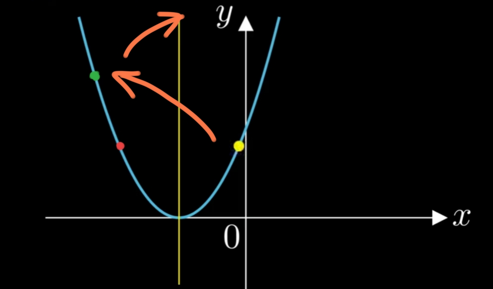
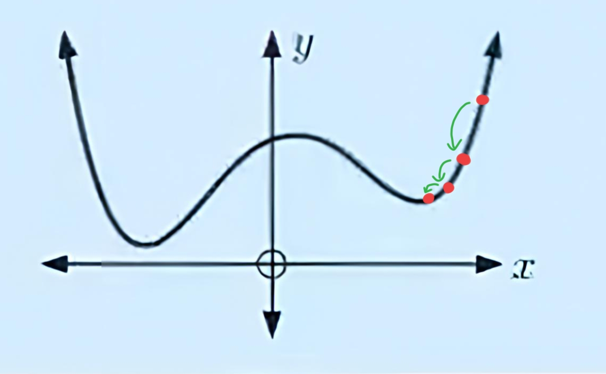

# 
感知机

###### 
YinKang'an

>我们的目标是让模型准确预测判断

## 损失函数

## 梯度
1. **导数 derivate**
- **一维函数的导数**
    $f'(x)$ 代表在 $x$ 处的`变化率`,也就是`斜率`
    但它只是在平面的表示, $x$ 向左向右的表示 
    而导数是一个非常宽泛的概念,它是一个标量,反映一个变化的程度
- **二维函数的导数**
    以 $ Z = y^2 - x^2$ 为例,它有朝不同方向(朝 $x$ , $y$ 或 $x.y$ 之间)的变化率

    

    还有更高纬度的函数,因此产生了`偏微分`的概念
2. **偏微分 partial derivate**
    偏微分的方向是给定的自变量的方向,比如 $x$,$y$ 的方向
    $\frac{\partial z}{\partial x} = -2x$
    $\frac{\partial z}{\partial y} = +2y$
    这个函数有多少个自变量,他就有多少个偏微分
3. <u>**梯度 gradient**</u>
    - **简介**
    梯度是一个向量,它不是标量,它是一个特殊的导数,方向沿偏微分合成的方向
    $\nabla f = (\frac{\partial z}{\partial x_1};\frac{\partial z}{\partial x_2};...;\frac{\partial z}{\partial x_n})$ 
    以 $ Z = y^2 - x^2$ 为例,它的梯度是 $\nabla f(x,y)= (-2x,2y)$ 这样的向量
    - **梯度的意义**
        

        - 长度代表变化速率
        - 方向代表增长方向
    - <u>**借梯度寻找最小值**->**梯度下降算法寻找最小值**</u>

        - 先用`一元函数`举例子吧
            以 $L = (b+n)^2 + m$ 为例
            

            1. 不妨先随便取一点,可以计算当前点的斜率 $\frac{\text dL}{\text db}$ ,再乘上 $\varepsilon$ ,箭头的方向为斜率的负方向(斜率为负,要向右移动,加负号)(方向)
            2. 然后让 $\rm b$ 更新为 $\text b - \varepsilon \frac{\text dL}{\text db} $(步长) ,这样就发现 $L$ 变得更小了
            3. 然后继续迭代
            4. 当到达最低点时,斜率不再变化, $\rm b$ 不再变化,就找到了最低点
        - 再看看<u>**多元函数**</u>形式 
            $(\frac{\partial z}{\partial x_1};\frac{\partial z}{\partial x_2};...;\frac{\partial z}{\partial x_n})$ 
            就告诉你走的大小了,但是要下降,坐标要加一个`-`号 
            $-(\frac{\partial z}{\partial x_1};\frac{\partial z}{\partial x_2};...;\frac{\partial z}{\partial x_n})$ 
            假设现在在 $(k_n,b_n)$ ,那下一个落脚点就是 
            $K_{n+1} = K_n - \varepsilon\frac{\partial Z}{\partial K}$ 
            $B_{n+1} = B_n - \varepsilon\frac{\partial Z}{\partial B}$ 
            当偏导为`0`时,这里的 $K$ $B$ 就是线性回归的损失函数的斜率,截距了
             
        - 但是出现了一些情况:

            1. $\varepsilon$ 又称学习率,不一定是定值
                $\varepsilon$ 的设置可能会出现三点情况:

                1.会在等高处来回振荡

                

                2.会越跳越远

                

                3.陷入到 `局部最优`

                

            